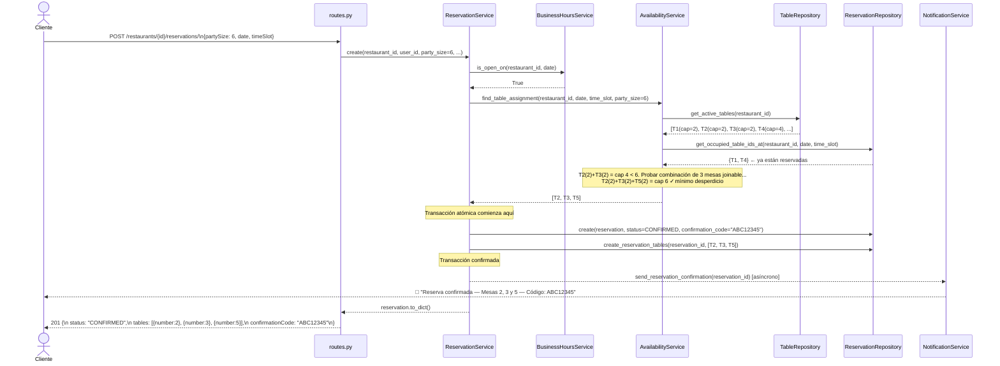
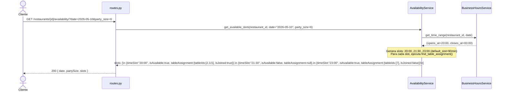
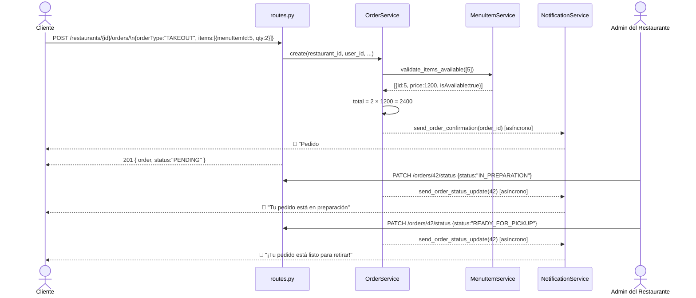
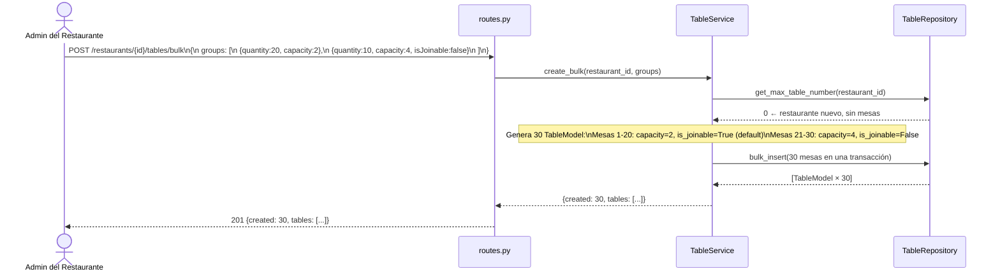
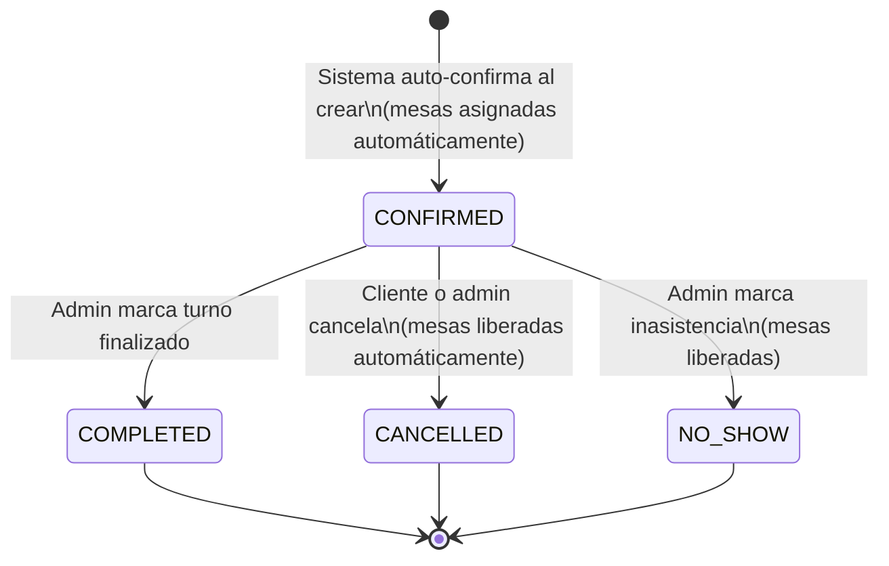
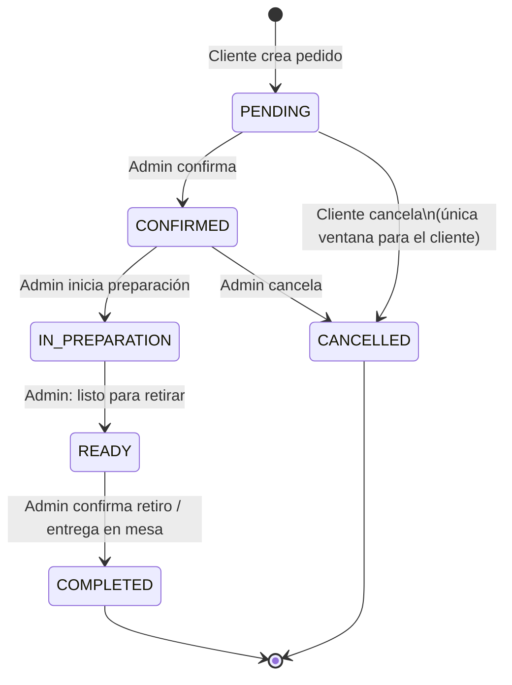

# Abricot — Propuesta Técnica Completa

**SaaS Resiliente de Reservas y Pedidos Gastronómicos**

Este documento describe la totalidad del diseño técnico necesario para implementar las 5 funcionalidades clave de Abricot. Incluye el modelo de base de datos, todos los endpoints REST, todos los schemas de request/response y todas las funciones de servicios (sin código). Es la fuente de verdad para el equipo de backend.

---

## Tabla de Contenidos

1. [Estado Actual vs. Estado Objetivo](#1-estado-actual-vs-estado-objetivo)
2. [Diseño de Base de Datos](#2-diseño-de-base-de-datos)
3. [Definición de Modelos](#3-definición-de-modelos)
4. [Enumerados (Enums)](#4-enumerados-enums)
5. [Superficie REST Completa](#5-superficie-rest-completa)
6. [Schemas de Request y Response](#6-schemas-de-request-y-response)
7. [Servicios y Funciones](#7-servicios-y-funciones)
8. [Flujos Clave (Diagramas de Secuencia)](#8-flujos-clave-diagramas-de-secuencia)
9. [Máquinas de Estado](#9-máquinas-de-estado)

---

## 1. Estado Actual vs. Estado Objetivo

### Qué ya existe y está correcto

| Componente | Estado |
|---|---|
| `User` (id, email, password_hash, name, surname, created_at) | ✅ Existe — necesita campo `role` |
| `Restaurant` (id, name, address, phone, email, description, photo_url, created_at) | ✅ Existe — necesita `city_id`, `neighbourhood_id`, `price_range_id` (FKs normalizados), `allow_table_joining`, `default_slot_duration_minutes`; tipos de cocina en `RestaurantCuisine` |
| `AuthService` — register, login, refresh token | ✅ Completo |
| `RestaurantService` — CRUD + upload_photo | ✅ Existe — necesita `search()` con filtros, y `create()` debe auto-asignar admin |
| `S3Client` — carga de fotos para restaurantes y (futuro) ítems de menú | ✅ Correcto, reutilizable |
| JWT via `Authorization: Bearer` header | ✅ Correcto |
| Arquitectura por capas (api → service → repository → model) | ✅ En lugar |

### Qué falta construir (5 funcionalidades)

| Funcionalidad | Modelos nuevos | Servicios nuevos |
|---|---|---|
| F1: Dashboard de Disponibilidad | `Table`, `ReservationTable`, `BusinessHours` | `TableService`, `BusinessHoursService`, `AvailabilityService` |
| F2: Motor de Reservas | `Reservation` (con campos de huésped y `source`) | `ReservationService` (incluyendo `create_for_admin`), `NotificationService` |
| F3: Pedidos con Seguimiento | `Menu`, `MenuCategory`, `MenuItem`, `Order`, `OrderItem` | `MenuService`, `MenuCategoryService`, `MenuItemService`, `OrderService` |
| F4: Promociones Ad Hoc | `Promotion`, `PromotionItem` | `PromotionService` (extiende `NotificationService`) |
| F5: Analítica Predictiva | ninguno (consultas sobre datos existentes) | `AnalyticsService` |
| Transversal | `RestaurantAdmin`, `NotificationPreference`, `Country`, `Province`, `City`, `Neighbourhood`, `PriceRange`, `CuisineType`, `RestaurantCuisine` | `UserService`, `RestaurantAdminService`, `LookupService` |

---

## 2. Diseño de Base de Datos

### 2.1 Diagrama Entidad-Relación Completo

```mermaid
erDiagram

    USER {
        uuid id PK
        string email UK
        string password_hash
        string name
        string surname
        enum role "CUSTOMER | RESTAURANT_ADMIN | SUPER_ADMIN"
        datetime created_at
    }

    COUNTRY {
        uuid id PK
        string name UK
        string iso_code "ej: AR, US, ES"
    }

    PROVINCE {
        uuid id PK
        uuid country_id FK
        string name
    }

    CITY {
        uuid id PK
        uuid province_id FK
        string name
    }

    NEIGHBOURHOOD {
        uuid id PK
        uuid city_id FK
        string name
    }

    PRICE_RANGE {
        uuid id PK
        string slug UK "ECONOMICO | MODERADO | ELEGANTE | EXCLUSIVO"
        string label "$ | $$ | $$$ | $$$$"
        string description "Menos de $5.000 | ..."
        int sort_order
    }

    CUISINE_TYPE {
        uuid id PK
        string slug UK "ARGENTINA | ITALIANA | ..."
        string label "Parrilla y Criolla | Pasta y Pizza | ..."
    }

    RESTAURANT {
        uuid id PK
        string name
        string address
        uuid city_id FK
        uuid neighbourhood_id FK "nullable"
        uuid price_range_id FK "nullable"
        string phone
        string email
        string description
        string photo_url
        bool allow_table_joining
        int default_slot_duration_minutes
        datetime created_at
    }

    RESTAURANT_CUISINE {
        uuid id PK
        uuid restaurant_id FK
        uuid cuisine_type_id FK
    }

    RESTAURANT_ADMIN {
        uuid id PK
        uuid user_id FK
        uuid restaurant_id FK
    }

    TABLE {
        uuid id PK
        uuid restaurant_id FK
        int number
        int capacity
        string name
        bool is_joinable
        bool is_active
    }

    BUSINESS_HOURS {
        uuid id PK
        uuid restaurant_id FK
        int day_of_week "0=Lun … 6=Dom"
        time opens_at
        time closes_at
        bool is_closed
    }

    RESERVATION {
        uuid id PK
        uuid restaurant_id FK
        uuid user_id FK "nullable — null si el admin reserva por teléfono/evento"
        string guest_name "nullable — nombre del grupo si no hay user_id"
        string guest_phone "nullable"
        string guest_email "nullable"
        enum source "ONLINE | PHONE | EVENT"
        int party_size
        date date
        time time_slot
        enum status "CONFIRMED | CANCELLED | COMPLETED | NO_SHOW"
        string notes
        string confirmation_code UK
        datetime created_at
    }

    RESERVATION_TABLE {
        uuid id PK
        uuid reservation_id FK
        uuid table_id FK
    }

    MENU {
        uuid id PK
        uuid restaurant_id FK
        string name
        bool is_active
        datetime created_at
    }

    MENU_CATEGORY {
        uuid id PK
        uuid menu_id FK
        string name
        int display_order
        bool is_active
    }

    MENU_ITEM {
        uuid id PK
        uuid category_id FK
        string name
        string description
        decimal price
        string photo_url
        bool is_available
        datetime created_at
    }

    ORDER {
        uuid id PK
        uuid restaurant_id FK
        uuid user_id FK
        enum status "PENDING | CONFIRMED | IN_PREPARATION | READY | COMPLETED | CANCELLED"
        decimal total_amount
        string notes
        datetime estimated_ready_at
        datetime created_at
    }

    ORDER_ITEM {
        uuid id PK
        uuid order_id FK
        uuid menu_item_id FK
        int quantity
        decimal unit_price "snapshot del precio al momento del pedido"
        string notes
    }

    PROMOTION {
        uuid id PK
        uuid restaurant_id FK
        string title
        string description
        enum discount_type "PERCENTAGE | FIXED_AMOUNT | FREE_ITEM"
        decimal discount_value
        date start_date
        date end_date
        bool is_active
        bool notify_users
        datetime created_at
    }

    PROMOTION_ITEM {
        uuid id PK
        uuid promotion_id FK
        uuid menu_item_id FK
    }

    NOTIFICATION_PREFERENCE {
        uuid id PK
        uuid user_id FK
        uuid restaurant_id FK
        bool receive_promotions
        bool receive_order_updates
        bool receive_reservation_reminders
    }

    COUNTRY ||--o{ PROVINCE : "contiene"
    PROVINCE ||--o{ CITY : "contiene"
    CITY ||--o{ NEIGHBOURHOOD : "contiene"
    CITY ||--o{ RESTAURANT : "ubicado en"
    NEIGHBOURHOOD ||--o{ RESTAURANT : "ubicado en (opcional)"
    PRICE_RANGE ||--o{ RESTAURANT : "categoriza"
    CUISINE_TYPE ||--o{ RESTAURANT_CUISINE : "clasifica"
    RESTAURANT ||--o{ RESTAURANT_CUISINE : "tiene"

    USER ||--o{ RESERVATION : "realiza"
    USER ||--o{ ORDER : "realiza"
    USER ||--o{ NOTIFICATION_PREFERENCE : "configura"
    USER ||--o{ RESTAURANT_ADMIN : "administra"

    RESTAURANT ||--o{ TABLE : "tiene"
    RESTAURANT ||--o{ BUSINESS_HOURS : "configura"
    RESTAURANT ||--o{ RESERVATION : "recibe"
    RESTAURANT ||--o{ MENU : "publica"
    RESTAURANT ||--o{ ORDER : "recibe"
    RESTAURANT ||--o{ PROMOTION : "ofrece"
    RESTAURANT ||--o{ RESTAURANT_ADMIN : "administrada por"
    RESTAURANT ||--o{ NOTIFICATION_PREFERENCE : "seguida por"

    RESERVATION ||--o{ RESERVATION_TABLE : "ocupa"
    TABLE ||--o{ RESERVATION_TABLE : "asignada en"

    MENU ||--o{ MENU_CATEGORY : "contiene"
    MENU_CATEGORY ||--o{ MENU_ITEM : "contiene"

    ORDER ||--o{ ORDER_ITEM : "contiene"
    ORDER_ITEM }|--|| MENU_ITEM : "referencia"

    PROMOTION ||--o{ PROMOTION_ITEM : "aplica a"
    PROMOTION_ITEM }|--|| MENU_ITEM : "referencia"
```

### 2.2 Decisiones de Diseño Clave

| Decisión | Justificación |
|---|---|
| Un admin puede crear múltiples restaurantes en distintos momentos | `RESTAURANT_ADMIN` es una tabla de join, no un campo en `USER`. Al crear un restaurante, el sistema inserta automáticamente una fila en `RESTAURANT_ADMIN` para el usuario creador. El mismo usuario puede repetir el proceso para un segundo restaurante sin perder acceso al primero. |
| Ubicación jerárquica normalizada en tablas propias | `COUNTRY → PROVINCE → CITY → NEIGHBOURHOOD`. `Restaurant` guarda `city_id` (requerido) y `neighbourhood_id` (opcional). Permite filtros exactos, autocompletado en el frontend y consistencia: dos restaurantes en "Palermo" comparten la misma fila, no dos strings distintos. |
| `PRICE_RANGE` es una tabla de referencia | Mismas 4 categorías pero como filas de BD. Permite mostrar labels y descripciones desde la API sin hardcodear nada en el frontend. El admin selecciona un ID; SUPER_ADMIN puede agregar o renombrar categorías sin deploys. |
| `CUISINE_TYPE` + `RESTAURANT_CUISINE` es N:M | Un restaurante puede tener múltiples tipos de cocina (ej: Japonesa + Fusión). `CUISINE_TYPE` es una tabla de referencia con slugs estables. `RESTAURANT_CUISINE` es la join. El frontend puede filtrar por uno o varios `cuisineTypeIds`. |
| No existe `order_type` ni `delivery_address` | El sistema no soporta delivery. Todos los pedidos son para consumir en el local o retirar en persona. Eliminar el campo evita lógica condicional y validaciones innecesarias. |
| El admin puede crear reservas sin usuario registrado | Para reservas por teléfono o eventos, `user_id` es nullable en `RESERVATION`. El campo `source` (`ONLINE/PHONE/EVENT`) indica el origen. Los campos `guest_name`, `guest_phone`, `guest_email` capturan los datos del grupo cuando no hay cuenta registrada. |
| Las reservas se auto-confirman al crearse | No hay intervención humana. El sistema valida disponibilidad y confirma inmediatamente. El admin solo cancela si es necesario. |
| `RESERVATION_TABLE` es una tabla de join N:M | Una reserva puede ocupar múltiples mesas unidas. Una mesa puede aparecer en múltiples reservas (en distintas fechas/horarios). Reemplaza el antiguo `table_id` FK directo en `RESERVATION`. |
| `TABLE.is_joinable` controla la combinabilidad | No todas las mesas de un restaurante se pueden unir (ej: la barra fija o las mesas de la entrada). El campo permite granularidad por mesa. |
| `RESTAURANT.allow_table_joining` es el master switch | Si es `False`, el algoritmo de disponibilidad nunca considera combinaciones, independientemente de `is_joinable` de las mesas. Si es `True`, usa el algoritmo de combinación. |
| La asignación de mesas ocurre dentro de la transacción de creación | Disponibilidad + asignación + creación de la reserva ocurren en una sola transacción de base de datos con `SELECT ... FOR UPDATE` para evitar race conditions en momentos de alta demanda (ej: viernes a la noche). |
| `ORDER_ITEM.unit_price` snapshottea el precio al momento del pedido | Los precios del menú cambian con el tiempo; el historial de pedidos debe ser inmutable. |
| `RESERVATION.confirmation_code` es único | Permite al cliente consultar su reserva sin estar logueado (vía link en el email de confirmación). |
| `BUSINESS_HOURS` tiene una fila por día (7 filas por restaurante) | Modelo simple y directo. La disponibilidad se calcula dinámicamente cruzando horarios + reservas existentes. |
| `PROMOTION_ITEM` es una tabla de join opcional | Si no hay filas en `PROMOTION_ITEM` para una promoción, la promoción aplica a todo el menú del restaurante. |
| `RESTAURANT_ADMIN` es una tabla de join | Un usuario puede administrar múltiples restaurantes (ej: cadenas de bares). |

---

## 3. Definición de Modelos

### 3.1 Modelos existentes (con cambios necesarios)

#### `User` — agregar `role`
| Campo | Tipo | Constraints |
|---|---|---|
| id | uuid v7 | PK, generated |
| email | string(255) | unique, not null, index |
| password_hash | string(255) | not null |
| name | string(100) | not null |
| surname | string(100) | not null |
| **role** | enum(UserRole) | not null, default=CUSTOMER |
| created_at | datetime(tz) | not null, default=now() |

#### `Restaurant` — reemplazar strings de ubicación/cocina/precio por FKs normalizados
| Campo | Tipo | Constraints |
|---|---|---|
| id | uuid v7 | PK, generated |
| name | string(150) | not null, index |
| address | string(255) | not null |
| **city_id** | uuid | FK → cities, not null, index |
| **neighbourhood_id** | uuid | FK → neighbourhoods, nullable, index |
| **price_range_id** | uuid | FK → price_ranges, nullable, index |
| phone | string(30) | not null |
| email | string(255) | nullable |
| description | text | nullable |
| photo_url | string(500) | nullable |
| **allow_table_joining** | bool | not null, default=False |
| **default_slot_duration_minutes** | int | not null, default=90 |
| created_at | datetime(tz) | not null |
> Los tipos de cocina se almacenan en `RestaurantCuisine` (N:M). Un restaurante puede tener entre 1 y N entradas.

### 3.2 Modelos nuevos

#### `Country` — tabla de referencia de países
| Campo | Tipo | Constraints |
|---|---|---|
| id | uuid v7 | PK, generated |
| name | string(100) | not null, unique |
| iso_code | string(3) | not null, unique (ej: `AR`, `US`, `ES`) |

#### `Province` — provincia, estado o región dentro de un país
| Campo | Tipo | Constraints |
|---|---|---|
| id | uuid v7 | PK, generated |
| country_id | uuid | FK → countries, not null, index |
| name | string(100) | not null |
| | | UNIQUE(country_id, name) |

#### `City` — ciudad o localidad dentro de una provincia
| Campo | Tipo | Constraints |
|---|---|---|
| id | uuid v7 | PK, generated |
| province_id | uuid | FK → provinces, not null, index |
| name | string(100) | not null |
| | | UNIQUE(province_id, name) |

#### `Neighbourhood` — barrio o zona dentro de una ciudad
| Campo | Tipo | Constraints |
|---|---|---|
| id | uuid v7 | PK, generated |
| city_id | uuid | FK → cities, not null, index |
| name | string(100) | not null |
| | | UNIQUE(city_id, name) |

#### `PriceRange` — tabla de referencia de rangos de precio
| Campo | Tipo | Constraints |
|---|---|---|
| id | uuid v7 | PK, generated |
| slug | string(20) | not null, unique (ej: `ECONOMICO`) |
| label | string(10) | not null (ej: `$`, `$$`) |
| description | string(200) | nullable (ej: `Menos de $5.000 por persona`) |
| sort_order | int | not null (controla el orden en filtros y dropdowns) |
> Pre-poblado con 4 filas en el seed inicial. Solo SUPER_ADMIN puede modificar.

#### `CuisineType` — tabla de referencia de tipos de cocina
| Campo | Tipo | Constraints |
|---|---|---|
| id | uuid v7 | PK, generated |
| slug | string(30) | not null, unique (ej: `ARGENTINA`, `JAPONESA`) |
| label | string(100) | not null (ej: `Parrilla y Criolla`) |
> Pre-poblado con los tipos iniciales en el seed. Solo SUPER_ADMIN puede agregar o deshabilitar.

#### `RestaurantCuisine` — join N:M entre restaurante y tipos de cocina
| Campo | Tipo | Constraints |
|---|---|---|
| id | uuid v7 | PK, generated |
| restaurant_id | uuid | FK → restaurants, not null, index |
| cuisine_type_id | uuid | FK → cuisine_types, not null, index |
| | | UNIQUE(restaurant_id, cuisine_type_id) |

#### `RestaurantAdmin`
| Campo | Tipo | Constraints |
|---|---|---|
| id | uuid v7 | PK, generated |
| user_id | uuid | FK → users, not null, index |
| restaurant_id | uuid | FK → restaurants, not null, index |
| | | UNIQUE(user_id, restaurant_id) |

#### `Table`
| Campo | Tipo | Constraints |
|---|---|---|
| id | uuid v7 | PK, generated |
| restaurant_id | uuid | FK → restaurants, not null, index |
| number | int | not null |
| capacity | int | not null |
| name | string(50) | nullable (ej: "Mesa VIP", "Terraza 3") |
| **is_joinable** | bool | not null, default=True — si puede unirse con otras mesas |
| is_active | bool | not null, default=True |
| | | UNIQUE(restaurant_id, number) |

#### `BusinessHours`
| Campo | Tipo | Constraints |
|---|---|---|
| id | uuid v7 | PK, generated |
| restaurant_id | uuid | FK → restaurants, not null, index |
| day_of_week | int | not null (0=Lun, 6=Dom) |
| opens_at | time | nullable |
| closes_at | time | nullable |
| is_closed | bool | not null, default=False |
| | | UNIQUE(restaurant_id, day_of_week) |

#### `Reservation`
> **Sin `table_id` directo.** Las mesas se asignan a través de `ReservationTable`.
> **Sin estado `PENDING`.** Se auto-confirma al crearse si hay disponibilidad.
> **`user_id` es nullable.** Cuando un admin crea una reserva por teléfono o evento, no hay usuario registrado.

| Campo | Tipo | Constraints |
|---|---|---|
| id | uuid v7 | PK, generated |
| restaurant_id | uuid | FK → restaurants, not null, index |
| user_id | uuid | FK → users, **nullable**, index |
| **guest_name** | string(150) | nullable — requerido si `user_id` es null |
| **guest_phone** | string(30) | nullable |
| **guest_email** | string(255) | nullable |
| **source** | enum(ReservationSource) | not null, default=ONLINE |
| party_size | int | not null |
| date | date | not null, index |
| time_slot | time | not null |
| status | enum(ReservationStatus) | not null, default=CONFIRMED |
| notes | text | nullable |
| confirmation_code | string(12) | unique, not null |
| created_at | datetime(tz) | not null |
> Constraint de aplicación: exactamente uno de `user_id` o `guest_name` debe ser no-nulo.

#### `ReservationTable` — tabla de join N:M entre reservas y mesas
| Campo | Tipo | Constraints |
|---|---|---|
| id | uuid v7 | PK, generated |
| reservation_id | uuid | FK → reservations, not null, index |
| table_id | uuid | FK → tables, not null, index |
| | | UNIQUE(reservation_id, table_id) |

#### `Menu`
| Campo | Tipo | Constraints |
|---|---|---|
| id | uuid v7 | PK, generated |
| restaurant_id | uuid | FK → restaurants, not null, index |
| name | string(150) | not null |
| is_active | bool | not null, default=True |
| created_at | datetime(tz) | not null |

#### `MenuCategory`
| Campo | Tipo | Constraints |
|---|---|---|
| id | uuid v7 | PK, generated |
| menu_id | uuid | FK → menus, not null, index |
| name | string(100) | not null |
| display_order | int | not null, default=0 |
| is_active | bool | not null, default=True |

#### `MenuItem`
| Campo | Tipo | Constraints |
|---|---|---|
| id | uuid v7 | PK, generated |
| category_id | uuid | FK → menu_categories, not null, index |
| name | string(150) | not null |
| description | text | nullable |
| price | numeric(10,2) | not null |
| photo_url | string(500) | nullable |
| is_available | bool | not null, default=True |
| created_at | datetime(tz) | not null |

#### `Order`
> Sin `order_type` ni `delivery_address`. El sistema no soporta delivery; todos los pedidos son para el local.

| Campo | Tipo | Constraints |
|---|---|---|
| id | uuid v7 | PK, generated |
| restaurant_id | uuid | FK → restaurants, not null, index |
| user_id | uuid | FK → users, not null, index |
| status | enum(OrderStatus) | not null, default=PENDING |
| total_amount | numeric(10,2) | not null |
| notes | text | nullable |
| estimated_ready_at | datetime(tz) | nullable |
| created_at | datetime(tz) | not null, index |

#### `OrderItem`
| Campo | Tipo | Constraints |
|---|---|---|
| id | uuid v7 | PK, generated |
| order_id | uuid | FK → orders, not null, index |
| menu_item_id | uuid | FK → menu_items, not null |
| quantity | int | not null |
| unit_price | numeric(10,2) | not null (snapshot del precio actual) |
| notes | text | nullable |

#### `Promotion`
| Campo | Tipo | Constraints |
|---|---|---|
| id | uuid v7 | PK, generated |
| restaurant_id | uuid | FK → restaurants, not null, index |
| title | string(200) | not null |
| description | text | nullable |
| discount_type | enum(DiscountType) | not null |
| discount_value | numeric(10,2) | not null |
| start_date | date | not null, index |
| end_date | date | not null, index |
| is_active | bool | not null, default=True |
| notify_users | bool | not null, default=False |
| created_at | datetime(tz) | not null |

#### `PromotionItem`
| Campo | Tipo | Constraints |
|---|---|---|
| id | uuid v7 | PK, generated |
| promotion_id | uuid | FK → promotions, not null, index |
| menu_item_id | uuid | FK → menu_items, not null |
| | | UNIQUE(promotion_id, menu_item_id) |

#### `NotificationPreference`
| Campo | Tipo | Constraints |
|---|---|---|
| id | uuid v7 | PK, generated |
| user_id | uuid | FK → users, not null, index |
| restaurant_id | uuid | FK → restaurants, not null, index |
| receive_promotions | bool | not null, default=True |
| receive_order_updates | bool | not null, default=True |
| receive_reservation_reminders | bool | not null, default=True |
| | | UNIQUE(user_id, restaurant_id) |

---

## 4. Enumerados (Enums)

### `UserRole`
| Valor | Descripción |
|---|---|
| `CUSTOMER` | Usuario final — puede hacer reservas y pedidos |
| `RESTAURANT_ADMIN` | Dueño/gerente — administra su restaurante |
| `SUPER_ADMIN` | Staff de Abricot — acceso global |

### `ReservationSource`
| Valor | Quién crea | Descripción |
|---|---|---|
| `ONLINE` | Cliente (app) | Reserva hecha por el usuario desde la plataforma |
| `PHONE` | Admin | Admin creó la reserva tomando un llamado telefónico |
| `EVENT` | Admin | Admin creó la reserva para un evento o grupo grande |

### `ReservationStatus`
> No existe `PENDING`. Las reservas se confirman automáticamente al crearse si hay disponibilidad. Si no hay disponibilidad, la creación falla con 409.

| Valor | Quién lo establece | Descripción |
|---|---|---|
| `CONFIRMED` | Sistema (al crear) | Auto-confirmada — mesas asignadas automáticamente |
| `CANCELLED` | Cliente o Admin | Cancelada. El campo `cancelled_by` puede registrar quién canceló |
| `COMPLETED` | Admin | Turno finalizado correctamente |
| `NO_SHOW` | Admin | El cliente no se presentó |

### `OrderStatus`
> Sin estados de delivery. El flujo es lineal: recibido → confirmado → en preparación → listo → retirado.

| Valor | Descripción |
|---|---|
| `PENDING` | Recibido, el restaurante aún no lo vio |
| `CONFIRMED` | Confirmado por el restaurante |
| `IN_PREPARATION` | En cocina |
| `READY` | Listo para retirar en el mostrador |
| `COMPLETED` | Retirado / entregado en mesa — cierre del pedido |
| `CANCELLED` | Cancelado |

### `DiscountType`
| Valor | Descripción |
|---|---|
| `PERCENTAGE` | Descuento porcentual (ej: 20%) |
| `FIXED_AMOUNT` | Descuento fijo en moneda (ej: $500) |
| `FREE_ITEM` | Ítem gratis con la compra |

---

## 5. Superficie REST Completa

La URL base de todos los endpoints es `/`. Convención de auth:
- 🔓 = público (sin token)
- 🔑 = requiere access token (`Authorization: Bearer <accessToken>`)
- 🔐 = requiere ser admin del restaurante

### 5.1 Datos de Referencia (lookup tables)

Endpoints de solo lectura para poblar dropdowns y filtros en el frontend. Todos públicos. Las escrituras son exclusivas de SUPER_ADMIN (no listadas aquí por brevedad).

| Método | Path | Auth | Descripción |
|---|---|---|---|
| GET | `/cuisines/` | 🔓 | Listar todos los tipos de cocina |
| GET | `/price-ranges/` | 🔓 | Listar todos los rangos de precio (ordenados por `sort_order`) |
| GET | `/countries/` | 🔓 | Listar países |
| GET | `/countries/{id}/provinces/` | 🔓 | Listar provincias de un país |
| GET | `/provinces/{id}/cities/` | 🔓 | Listar ciudades de una provincia |
| GET | `/cities/{id}/neighbourhoods/` | 🔓 | Listar barrios de una ciudad |

### 5.2 Autenticación

| Método | Path | Auth | Descripción |
|---|---|---|---|
| POST | `/auth/register` | 🔓 | Registro de nuevo usuario |
| POST | `/auth/login` | 🔓 | Login con email y contraseña |
| POST | `/auth/refresh` | 🔑 refresh | Obtener nuevo access token |

### 5.3 Restaurantes

| Método | Path | Auth | Descripción |
|---|---|---|---|
| GET | `/restaurants/` | 🔓 | Buscar restaurantes con filtros opcionales (ver query params abajo) |
| POST | `/restaurants/` | 🔑 | Crear restaurante — auto-asigna al creador como admin del nuevo restaurante |
| GET | `/restaurants/{id}` | 🔓 | Obtener restaurante por ID |
| PUT | `/restaurants/{id}` | 🔐 | Actualizar restaurante |
| DELETE | `/restaurants/{id}` | 🔐 | Eliminar restaurante |
| POST | `/restaurants/{id}/photo` | 🔐 | Subir foto del restaurante (S3) |

**Query params de `GET /restaurants/`:**

| Parámetro | Tipo | Descripción |
|---|---|---|
| `name` | string | Búsqueda parcial por nombre (ILIKE `%name%`, case-insensitive) |
| `country_id` | string (uuid) | ID del país |
| `province_id` | string (uuid) | ID de la provincia |
| `city_id` | string (uuid) | ID de la ciudad |
| `neighbourhood_id` | string (uuid) | ID del barrio |
| `price_range_id` | string (uuid) | ID del rango de precio (de `GET /price-ranges/`) |
| `cuisine_type_id` | string (uuid) | ID del tipo de cocina (de `GET /cuisines/`) — puede repetirse para OR |
| `page` | int | Página (default: 1) |
| `per_page` | int | Resultados por página (default: 20, máx: 100) |

> Todos los filtros son opcionales y combinables. `cuisine_type_id` puede enviarse múltiples veces para filtrar restaurantes que tengan **alguno** de los tipos indicados.

### 5.4 Mesas — F1

| Método | Path | Auth | Descripción |
|---|---|---|---|
| GET | `/restaurants/{id}/tables/` | 🔐 | Listar todas las mesas del restaurante |
| POST | `/restaurants/{id}/tables/` | 🔐 | Crear una mesa individual |
| **POST** | **`/restaurants/{id}/tables/bulk`** | 🔐 | **Crear mesas en lote** (ej: 20 de cap. 2 y 10 de cap. 4) |
| GET | `/restaurants/{id}/tables/{table_id}` | 🔐 | Obtener mesa por ID |
| PUT | `/restaurants/{id}/tables/{table_id}` | 🔐 | Actualizar mesa |
| DELETE | `/restaurants/{id}/tables/{table_id}` | 🔐 | Eliminar mesa |

### 5.4 Horarios de Negocio — F1

| Método | Path | Auth | Descripción |
|---|---|---|---|
| GET | `/restaurants/{id}/business-hours/` | 🔓 | Obtener los 7 días de horarios |
| PUT | `/restaurants/{id}/business-hours/` | 🔐 | Reemplazar todos los horarios (bulk) |

### 5.5 Disponibilidad — F1

| Método | Path | Auth | Descripción |
|---|---|---|---|
| GET | `/restaurants/{id}/availability/` | 🔓 | Listar franjas disponibles (`?date=YYYY-MM-DD&party_size=N`) |

### 5.6 Reservas — F2

| Método | Path | Auth | Descripción |
|---|---|---|---|
| POST | `/restaurants/{id}/reservations/` | 🔑 | Cliente crea reserva — se auto-confirma si hay disponibilidad |
| **POST** | **`/restaurants/{id}/reservations/admin`** | 🔐 | **Admin crea reserva** para llamado telefónico o evento (puede no tener usuario registrado) |
| GET | `/restaurants/{id}/reservations/` | 🔐 | Admin lista todas las reservas del restaurante |
| GET | `/reservations/{reservation_id}` | 🔑 | Ver una reserva (cliente dueño o admin) |
| PATCH | `/reservations/{reservation_id}/reassign-tables` | 🔐 | Admin reasigna mesas manualmente |
| PATCH | `/reservations/{reservation_id}/cancel` | 🔑 | Cliente o admin cancela |
| PATCH | `/reservations/{reservation_id}/complete` | 🔐 | Admin marca como completada |
| PATCH | `/reservations/{reservation_id}/no-show` | 🔐 | Admin marca como no-show |
| GET | `/users/{user_id}/reservations/` | 🔑 | Cliente lista sus propias reservas (`user_id` = JWT) |
| GET | `/reservations/lookup` | 🔓 | Consultar reserva por código de confirmación (`?code=XXXX`) |

### 5.7 Menús — F3

| Método | Path | Auth | Descripción |
|---|---|---|---|
| GET | `/restaurants/{id}/menus/` | 🔓 | Listar menús del restaurante |
| POST | `/restaurants/{id}/menus/` | 🔐 | Crear menú |
| GET | `/restaurants/{id}/menus/{menu_id}` | 🔓 | Obtener menú completo (categorías e ítems anidados) |
| PUT | `/restaurants/{id}/menus/{menu_id}` | 🔐 | Actualizar menú |
| DELETE | `/restaurants/{id}/menus/{menu_id}` | 🔐 | Eliminar menú |
| PATCH | `/restaurants/{id}/menus/{menu_id}/activate` | 🔐 | Activar este menú (desactiva el anterior) |

### 5.8 Categorías de Menú — F3

| Método | Path | Auth | Descripción |
|---|---|---|---|
| GET | `/menus/{menu_id}/categories/` | 🔓 | Listar categorías de un menú |
| POST | `/menus/{menu_id}/categories/` | 🔐 | Crear categoría |
| PUT | `/menus/{menu_id}/categories/{cat_id}` | 🔐 | Actualizar categoría |
| DELETE | `/menus/{menu_id}/categories/{cat_id}` | 🔐 | Eliminar categoría |
| PATCH | `/menus/{menu_id}/categories/reorder` | 🔐 | Reordenar categorías (body: lista de IDs en orden) |

### 5.9 Ítems de Menú — F3

| Método | Path | Auth | Descripción |
|---|---|---|---|
| GET | `/categories/{cat_id}/items/` | 🔓 | Listar ítems de una categoría |
| POST | `/categories/{cat_id}/items/` | 🔐 | Crear ítem |
| GET | `/items/{item_id}` | 🔓 | Obtener ítem por ID |
| PUT | `/items/{item_id}` | 🔐 | Actualizar ítem |
| DELETE | `/items/{item_id}` | 🔐 | Eliminar ítem |
| POST | `/items/{item_id}/photo` | 🔐 | Subir foto del ítem (S3) |
| PATCH | `/items/{item_id}/availability` | 🔐 | Toggle disponibilidad (disponible / agotado) |

### 5.10 Pedidos — F3

| Método | Path | Auth | Descripción |
|---|---|---|---|
| POST | `/restaurants/{id}/orders/` | 🔑 | Cliente crea pedido |
| GET | `/restaurants/{id}/orders/` | 🔐 | Admin lista pedidos del restaurante (filtrable por status) |
| GET | `/orders/{order_id}` | 🔑 | Ver pedido (cliente dueño o admin) |
| PATCH | `/orders/{order_id}/status` | 🔐 | Admin actualiza el estado del pedido |
| PATCH | `/orders/{order_id}/cancel` | 🔑 | Cliente cancela (solo si PENDING) |
| GET | `/users/{user_id}/orders/` | 🔑 | Cliente lista sus propios pedidos (`user_id` = JWT) |

### 5.11 Promociones — F4

| Método | Path | Auth | Descripción |
|---|---|---|---|
| GET | `/restaurants/{id}/promotions/` | 🔓 | Listar promociones activas de un restaurante |
| POST | `/restaurants/{id}/promotions/` | 🔐 | Crear promoción |
| GET | `/restaurants/{id}/promotions/{promo_id}` | 🔓 | Obtener promoción |
| PUT | `/restaurants/{id}/promotions/{promo_id}` | 🔐 | Actualizar promoción |
| PATCH | `/restaurants/{id}/promotions/{promo_id}/deactivate` | 🔐 | Dar de baja promoción |
| PATCH | `/restaurants/{id}/promotions/{promo_id}/activate` | 🔐 | Reactivar promoción |
| DELETE | `/restaurants/{id}/promotions/{promo_id}` | 🔐 | Eliminar promoción permanentemente |
| GET | `/promotions/feed` | 🔓 | Feed global de todas las promociones activas en la plataforma |

### 5.12 Preferencias de Notificación

| Método | Path | Auth | Descripción |
|---|---|---|---|
| GET | `/users/{user_id}/notification-preferences/` | 🔑 | Listar preferencias del usuario (`user_id` = JWT) |
| PUT | `/users/{user_id}/notification-preferences/{restaurant_id}` | 🔑 | Actualizar preferencias para un restaurante (`user_id` = JWT) |

### 5.13 Perfil de Usuario

| Método | Path | Auth | Descripción |
|---|---|---|---|
| GET | `/users/{user_id}` | 🔑 | Ver perfil (`user_id` debe coincidir con JWT) |
| PUT | `/users/{user_id}` | 🔑 | Actualizar perfil (name, surname) |
| PUT | `/users/{user_id}/password` | 🔑 | Cambiar contraseña |
| GET | `/users/{user_id}/restaurants/` | 🔑 | Listar restaurantes que administra el usuario (`user_id` = JWT) |

### 5.14 Analytics — F5

| Método | Path | Auth | Descripción |
|---|---|---|---|
| GET | `/restaurants/{id}/analytics/occupancy` | 🔐 | Ocupación histórica (`?start=&end=`) |
| GET | `/restaurants/{id}/analytics/orders` | 🔐 | Volumen y revenue de pedidos (`?start=&end=`) |
| GET | `/restaurants/{id}/analytics/popular-items` | 🔐 | Ítems más pedidos (`?start=&end=&limit=10`) |
| GET | `/restaurants/{id}/analytics/promotions` | 🔐 | Impacto de promociones (`?start=&end=`) |
| GET | `/restaurants/{id}/analytics/peak-hours` | 🔐 | Horas pico de reservas y pedidos |

---

## 6. Schemas de Request y Response

### 6.1 Auth (existentes — referencia)

**`RegisterRequest`**: `email`, `password`, `name`, `surname`
**`LoginRequest`**: `email`, `password`
**`AuthResponse`**: `accessToken`, `refreshToken`, `user { id, email, name, surname, role, createdAt }`
**`RefreshResponse`**: `accessToken`

### 6.2 Restaurante (existente + cambios)

**`RestaurantCreateRequest`** / **`RestaurantUpdateRequest`**:
| Campo | Requerido | Tipo | Descripción |
|---|---|---|---|
| `name` | ✅ | string | Nombre del restaurante |
| `address` | ✅ | string | Dirección física completa |
| `cityId` | ✅ | string (uuid) | ID de la ciudad (de `GET /provinces/{id}/cities/`) |
| `neighbourhoodId` | ❌ | string (uuid) | ID del barrio (de `GET /cities/{id}/neighbourhoods/`) |
| `priceRangeId` | ❌ | string (uuid) | ID del rango de precio (de `GET /price-ranges/`) |
| `cuisineTypeIds` | ❌ | string[] (uuid[]) | Lista de IDs de tipos de cocina (al menos 1 recomendado) |
| `phone` | ✅ | string | Teléfono de contacto |
| `email` | ❌ | string | Email de contacto |
| `description` | ❌ | string | Descripción libre |
| `allowTableJoining` | ❌ | bool | Default `false` |
| `defaultSlotDurationMinutes` | ❌ | int | Default `90` |

**`RestaurantResponse`**:
```
{
  id, name, address, phone, email, description, photoUrl,
  allowTableJoining, defaultSlotDurationMinutes, createdAt,
  city: { id, name, province: { id, name, country: { id, name, isoCode } } },
  neighbourhood: { id, name } | null,
  priceRange: { id, slug, label, description } | null,
  cuisineTypes: [{ id, slug, label }]
}
```

**`RestaurantListResponse`**: `{ data: [RestaurantResponse], total, page, perPage }`
> El endpoint `GET /restaurants/` siempre devuelve este envelope paginado, incluso sin filtros.

**Schemas de lookup (solo lectura):**
- **`CuisineTypeResponse`**: `id`, `slug`, `label`
- **`PriceRangeResponse`**: `id`, `slug`, `label`, `description`, `sortOrder`
- **`CountryResponse`**: `id`, `name`, `isoCode`
- **`ProvinceResponse`**: `id`, `name`, `countryId`
- **`CityResponse`**: `id`, `name`, `provinceId`
- **`NeighbourhoodResponse`**: `id`, `name`, `cityId`

### 6.3 Mesas

**`TableCreateRequest`**: `number`, `capacity`, `name?`, `isJoinable?`, `isActive?`

**`TableUpdateRequest`**: `number`, `capacity`, `name?`, `isJoinable`, `isActive`

**`TableBulkCreateRequest`**: `groups: [{ quantity, capacity, isJoinable? }]`
> Ejemplo: `{ "groups": [{ "quantity": 20, "capacity": 2 }, { "quantity": 10, "capacity": 4, "isJoinable": false }] }`
> El sistema asigna números de mesa secuenciales automáticamente.

**`TableResponse`**: `id`, `restaurantId`, `number`, `capacity`, `name`, `isJoinable`, `isActive`

**`TableBulkCreateResponse`**: `{ created: int, tables: [TableResponse] }`

### 6.4 Horarios de Negocio

**`BusinessHoursBulkUpdateRequest`**: array de `{ dayOfWeek, opensAt?, closesAt?, isClosed }`

**`BusinessHoursResponse`**: array de `{ id, dayOfWeek, dayName, opensAt, closesAt, isClosed }`

### 6.5 Disponibilidad

**Query params**: `date` (YYYY-MM-DD), `partySize`

**`AvailabilityResponse`**:
```
{
  date,
  partySize,
  allowTableJoining,
  slots: [
    {
      timeSlot,
      isAvailable,
      tableAssignment: {
        tableIds: [string],
        tableNumbers: [int],
        totalCapacity: int,
        isJoined: bool   ← true si se combinaron múltiples mesas
      }
    }
  ]
}
```
> Los slots no disponibles se incluyen con `isAvailable: false` y `tableAssignment: null`, para que el frontend pueda mostrar visualmente qué horarios están ocupados.

### 6.6 Reservas

**`ReservationCreateRequest`** (cliente): `partySize`, `date`, `timeSlot`, `notes?`

**`ReservationAdminCreateRequest`** (admin — para teléfono / evento):
| Campo | Requerido | Descripción |
|---|---|---|
| `partySize` | ✅ | Tamaño del grupo |
| `date` | ✅ | Fecha (YYYY-MM-DD) |
| `timeSlot` | ✅ | Franja horaria (HH:MM) |
| `source` | ✅ | `PHONE` o `EVENT` |
| `guestName` | ✅* | Nombre del grupo — requerido si `userId` es null |
| `guestPhone` | ❌ | Teléfono de contacto del grupo |
| `guestEmail` | ❌ | Email del grupo (para envío de confirmación) |
| `userId` | ❌ | string (uuid). Si el grupo tiene cuenta registrada, el admin puede linkearla |
| `notes` | ❌ | Notas internas |

**`ReservationReassignTablesRequest`**: `tableIds: [string]` (uuid[])
> Permite al admin ajustar manualmente qué mesas se usan para una reserva confirmada.

**`ReservationCancelRequest`**: `reason?`

**`ReservationResponse`**:
```
{
  id, restaurantId, restaurantName,
  userId, guestName, guestPhone, guestEmail,
  source, partySize, date, timeSlot, status, notes, confirmationCode, createdAt,
  tables: [{ tableId, tableNumber, capacity }]
}
```

**`ReservationListResponse`**: `{ data: [ReservationResponse], total, page, perPage }`

### 6.7 Menús

**`MenuCreateRequest`** / **`MenuUpdateRequest`**: `name`, `isActive?`

**`MenuResponse`**: `id`, `restaurantId`, `name`, `isActive`, `createdAt`

**`MenuDetailResponse`**: igual que `MenuResponse` + `categories: [MenuCategoryDetailResponse]`

### 6.8 Categorías de Menú

**`MenuCategoryCreateRequest`** / **`MenuCategoryUpdateRequest`**: `name`, `displayOrder?`, `isActive?`

**`MenuCategoryReorderRequest`**: `orderedIds: [string]` (uuid[])

**`MenuCategoryResponse`**: `id`, `menuId`, `name`, `displayOrder`, `isActive`

**`MenuCategoryDetailResponse`**: igual + `items: [MenuItemResponse]`

### 6.9 Ítems de Menú

**`MenuItemCreateRequest`** / **`MenuItemUpdateRequest`**: `name`, `description?`, `price`, `isAvailable?`

**`MenuItemAvailabilityRequest`**: `isAvailable`

**`MenuItemResponse`**: `id`, `categoryId`, `name`, `description`, `price`, `photoUrl`, `isAvailable`, `createdAt`

### 6.10 Pedidos

**`OrderCreateRequest`**: `items: [{ menuItemId, quantity, notes? }]`, `notes?`

**`OrderStatusUpdateRequest`**: `status`, `estimatedReadyAt?`

**`OrderItemResponse`**: `id`, `menuItemId`, `menuItemName`, `quantity`, `unitPrice`, `notes`

**`OrderResponse`**: `id`, `restaurantId`, `restaurantName`, `userId`, `status`, `totalAmount`, `notes`, `estimatedReadyAt`, `items: [OrderItemResponse]`, `createdAt`

**`OrderListResponse`**: `{ data: [OrderResponse], total, page, perPage }`

### 6.11 Promociones

**`PromotionCreateRequest`** / **`PromotionUpdateRequest`**: `title`, `description?`, `discountType`, `discountValue`, `startDate`, `endDate`, `notifyUsers?`, `menuItemIds?: [string]` (uuid[])

**`PromotionResponse`**: `id`, `restaurantId`, `restaurantName`, `title`, `description`, `discountType`, `discountValue`, `startDate`, `endDate`, `isActive`, `notifyUsers`, `items?: [MenuItemResponse]`, `createdAt`

### 6.12 Preferencias de Notificación

**`NotificationPreferenceUpdateRequest`**: `receivePromotions`, `receiveOrderUpdates`, `receiveReservationReminders`

**`NotificationPreferenceResponse`**: `restaurantId`, `restaurantName`, `receivePromotions`, `receiveOrderUpdates`, `receiveReservationReminders`

### 6.13 Perfil de Usuario

**`UserProfileUpdateRequest`**: `name`, `surname`

**`UserPasswordChangeRequest`**: `currentPassword`, `newPassword`

**`UserProfileResponse`**: `id`, `email`, `name`, `surname`, `role`, `createdAt`

### 6.14 Analytics

**`OccupancyReportResponse`**: `{ restaurantId, period: {start, end}, totalReservations, totalCovers, occupancyByDay: [{date, reservations, covers, occupancyRate}] }`

**`OrdersReportResponse`**: `{ restaurantId, period, totalOrders, totalRevenue, averageOrderValue, ordersByStatus: [{status, count}], revenueByDay: [{date, revenue, orders}] }`

**`PopularItemsResponse`**: `{ restaurantId, period, items: [{menuItemId, name, quantitySold, revenue, rank}] }`

**`PromotionsReportResponse`**: `{ restaurantId, period, promotions: [{promotionId, title, ordersWithPromotion, revenueImpact, discountGiven}] }`

**`PeakHoursResponse`**: `{ restaurantId, period, reservationsByHour: [{hour, count}], ordersByHour: [{hour, count}] }`

---

## 7. Servicios y Funciones

### 7.0 `LookupService` 🔴 (nuevo — datos de referencia)

Servicio de solo lectura para poblar dropdowns. No tiene lógica de negocio.

- `get_all_cuisines() → list[dict]`
- `get_all_price_ranges() → list[dict]` (ordenados por `sort_order`)
- `get_all_countries() → list[dict]`
- `get_provinces_by_country(country_id) → list[dict]`
- `get_cities_by_province(province_id) → list[dict]`
- `get_neighbourhoods_by_city(city_id) → list[dict]`
- `get_or_create_city(city_name, province_id) → CityModel`
  - Upsert interno usado por `RestaurantService.create()` si el cliente envía nombres en lugar de IDs.
- `get_or_create_neighbourhood(neighbourhood_name, city_id) → NeighbourhoodModel`

### 7.1 `AuthService` ✅ (completo)

- `register(email, password, name, surname) → dict`
- `login(email, password) → dict`
- `refresh() → dict`

### 7.2 `UserService` 🔴 (nuevo)

- `get_profile(user_id) → dict`
- `update_profile(user_id, name, surname) → dict`
- `change_password(user_id, current_password, new_password) → None`
- `get_my_reservations(user_id, page, per_page) → dict`
- `get_my_orders(user_id, page, per_page) → dict`
- `get_my_restaurants(user_id) → list[dict]`
  - Delega a `RestaurantAdminService.get_restaurants_for_admin(user_id)`. Expuesto en `GET /users/{user_id}/restaurants/`.

### 7.3 `RestaurantService` — actualizar con nuevos campos y búsqueda filtrada

- `search(name?, country_id?, province_id?, city_id?, neighbourhood_id?, price_range_id?, cuisine_type_ids?, page, per_page) → dict`
  - Reemplaza el anterior `get_all()`. Todos los parámetros son opcionales.
  - `name` aplica `ILIKE %name%`. El resto son filtros por FK. `cuisine_type_ids` es una lista: retorna restaurantes que tengan **alguno** de los tipos (JOIN en `RESTAURANT_CUISINE` con `IN`).
  - Retorna `{ data: [dict], total, page, perPage }` siempre paginado.
- `get_by_id(restaurant_id) → dict`
- `create(creator_user_id, name, address, city_id, neighbourhood_id, price_range_id, cuisine_type_ids, phone, email, description, allow_table_joining, default_slot_duration_minutes) → dict`
  - Valida que `city_id` exista (y `neighbourhood_id` si se envía).
  - Crea el `Restaurant`, las filas en `RestaurantCuisine`, y la fila en `RestaurantAdmin` — todo en una transacción.
  - Si el usuario tiene `role=CUSTOMER`, lo eleva a `RESTAURANT_ADMIN` en la misma transacción.
- `update(restaurant_id, name, address, city_id, neighbourhood_id, price_range_id, cuisine_type_ids, phone, email, description, allow_table_joining, default_slot_duration_minutes) → dict`
  - Para `cuisine_type_ids`: reemplaza completamente las filas de `RestaurantCuisine` (delete + insert) en una transacción.
- `delete(restaurant_id) → None`
- `upload_photo(restaurant_id, file_storage) → dict`

### 7.4 `RestaurantAdminService` 🔴 (nuevo)

- `is_admin(user_id, restaurant_id) → bool`
  - Consulta `RESTAURANT_ADMIN` por el par `(user_id, restaurant_id)`. Usado en el guard 🔐 de todos los endpoints de administración.
- `add_admin(restaurant_id, user_id) → None`
  - Inserta fila en `RESTAURANT_ADMIN`. Eleva `user.role` a `RESTAURANT_ADMIN` si aún es `CUSTOMER`.
  - Falla con `ConflictError` si ya es admin de ese restaurante.
- `remove_admin(restaurant_id, user_id) → None`
  - Elimina la fila. Si el usuario ya no tiene ningún restaurante en `RESTAURANT_ADMIN`, baja su `role` a `CUSTOMER`.
- `get_restaurants_for_admin(user_id) → list[dict]`
  - JOIN `RESTAURANT_ADMIN` → `RESTAURANT` filtrado por `user_id`. Retorna todos los restaurantes que administra, sin importar cuántos sean ni cuándo fueron creados.

### 7.5 `TableService` 🔴 (nuevo — F1)

- `get_all(restaurant_id) → list[dict]`
- `get_by_id(restaurant_id, table_id) → dict`
- `create(restaurant_id, number, capacity, name, is_joinable) → dict`
- `create_bulk(restaurant_id, groups: list[{quantity, capacity, is_joinable}]) → dict`
  - Asigna números de mesa secuenciales (comenzando desde el número más alto existente + 1)
  - Crea todas las mesas en una sola transacción
  - Retorna `{ created: int, tables: [TableResponse] }`
- `update(restaurant_id, table_id, number, capacity, name, is_joinable, is_active) → dict`
- `delete(restaurant_id, table_id) → None`
  - Falla con error si la mesa tiene reservas futuras confirmadas
- `get_total_capacity(restaurant_id) → int`
  - Suma la capacidad de todas las mesas activas

### 7.6 `BusinessHoursService` 🔴 (nuevo — F1)

- `get_all(restaurant_id) → list[dict]`
- `bulk_update(restaurant_id, hours_data) → list[dict]`
  - Hace upsert de las 7 filas (crea las que no existen, actualiza las existentes)
- `is_open_on(restaurant_id, date) → bool`
- `get_time_range(restaurant_id, date) → tuple[time, time] | None`
  - Retorna `(opens_at, closes_at)` para la fecha, o `None` si está cerrado ese día

### 7.7 `AvailabilityService` 🔴 (nuevo — F1, corazón de F2)

Este es el servicio más complejo del sistema. Combina horarios, mesas, capacidad, unión de mesas y reservas existentes para determinar en qué franjas horarias puede entrar un grupo de N personas.

#### Algoritmo de asignación de mesas

Dado: `restaurant_id`, `date`, `time_slot`, `party_size`

1. Verificar que el restaurante esté abierto en esa fecha y hora (`BusinessHoursService.is_open_on`)
2. Obtener todas las mesas activas del restaurante
3. Obtener las mesas ya ocupadas en ese `date` + `time_slot` (mesas en `reservation_tables` donde la reserva tiene `status=CONFIRMED`)
4. Calcular mesas disponibles = activas − ocupadas
5. **Si `allow_table_joining = False`:**
   - Buscar la mesa disponible de menor capacidad que sea `>= party_size`
   - Si no existe → franja no disponible
6. **Si `allow_table_joining = True`:**
   - Primero intentar paso 5 (mesa individual)
   - Si falla, buscar la combinación mínima de mesas `is_joinable=True` cuya suma de capacidad sea `>= party_size`
   - Estrategia: probar combinaciones de 2 mesas, luego de 3, etc. (brute force — los restaurantes tienen ≤ 100 mesas, el espacio de búsqueda es manejable)
   - Elegir la combinación con menor desperdicio de capacidad (`sum_capacity - party_size` mínimo)
   - Si no existe ninguna combinación → franja no disponible
7. Retornar la asignación de mesas encontrada

> **Nota sobre concurrencia:** `assign_tables_for_reservation` debe ejecutarse dentro de una transacción con `SELECT ... FOR UPDATE` sobre las filas de `reservation_tables` para los slots afectados. Esto previene que dos usuarios simultáneos reserven las mismas mesas.

#### Funciones

- `get_available_slots(restaurant_id, date, party_size) → list[dict]`
  - Genera todos los time slots del día según `default_slot_duration_minutes`
  - Para cada slot, ejecuta el algoritmo de asignación
  - Retorna todos los slots con su estado (disponible/no disponible) y qué mesas se asignarían
- `find_table_assignment(restaurant_id, date, time_slot, party_size) → list[TableModel] | None`
  - Ejecuta el algoritmo de asignación para un slot específico
  - Retorna la lista de mesas a asignar, o `None` si no hay disponibilidad
- `assign_tables_for_reservation(reservation_id, table_ids) → None`
  - Crea las filas en `reservation_tables` dentro de una transacción
- `get_occupied_table_ids_at(restaurant_id, date, time_slot) → set[uuid]`
  - Consulta `reservation_tables` JOIN `reservations` para obtener mesas ocupadas en ese slot

### 7.8 `ReservationService` 🔴 (nuevo — F2)

- `create(restaurant_id, user_id, party_size, date, time_slot, notes) → dict`
  - Valida que el restaurante esté abierto (`BusinessHoursService`)
  - Llama a `AvailabilityService.find_table_assignment()` dentro de una transacción
  - Si no hay mesas disponibles → raise `ConflictError` (409)
  - Genera `confirmation_code` único (8 caracteres alfanuméricos en mayúsculas)
  - Crea la `Reservation` con `status=CONFIRMED`, `source=ONLINE`
  - Crea las filas en `ReservationTable` para las mesas asignadas
  - Todo en una sola transacción atómica
  - Dispara `NotificationService.send_reservation_confirmation()` de forma asíncrona
- `create_for_admin(restaurant_id, admin_user_id, party_size, date, time_slot, source, guest_name, guest_phone, guest_email, user_id, notes) → dict`
  - Exclusivo para `POST /restaurants/{id}/reservations/admin` (🔐)
  - Valida que exactamente uno de `user_id` o `guest_name` sea no-nulo
  - Valida `source` en `{PHONE, EVENT}` (no puede crear con `source=ONLINE`)
  - Misma lógica de disponibilidad y asignación que `create()`
  - Si se envía `guest_email`, dispara la notificación de confirmación al email del huésped
- `get_by_id(reservation_id, requesting_user_id) → dict`
  - Valida que el solicitante sea el dueño de la reserva o admin del restaurante
- `get_by_confirmation_code(code) → dict`
  - Público (para el link del email de confirmación)
- `list_for_restaurant(restaurant_id, date_from, date_to, status, source, page, per_page) → dict`
  - Filtrable por `source` además de `status` (ej: ver solo reservas telefónicas)
- `reassign_tables(reservation_id, table_ids) → dict`
  - Admin puede mover una reserva a otras mesas (ej: para organizar mejor el salón)
  - Valida que las nuevas mesas estén disponibles en ese slot y tengan capacidad suficiente
- `cancel(reservation_id, requesting_user_id, reason) → dict`
  - Valida que el solicitante sea el dueño de la reserva o admin del restaurante
  - Libera las mesas (elimina filas de `reservation_tables`)
  - Dispara `NotificationService.send_reservation_cancelled()` (al `user.email` o `guest_email`)
- `complete(reservation_id) → dict`
- `mark_no_show(reservation_id) → dict`
  - Libera las mesas de la misma forma que `cancel`

### 7.9 `MenuService` 🔴 (nuevo — F3)

- `get_all(restaurant_id) → list[dict]`
- `get_by_id(restaurant_id, menu_id) → dict`
- `get_detail(restaurant_id, menu_id) → dict` (con categorías e ítems anidados)
- `create(restaurant_id, name) → dict`
- `update(restaurant_id, menu_id, name) → dict`
- `delete(restaurant_id, menu_id) → None`
- `activate(restaurant_id, menu_id) → dict`
  - Desactiva el menú activo anterior en una transacción
- `get_active_menu(restaurant_id) → dict | None`

### 7.10 `MenuCategoryService` 🔴 (nuevo — F3)

- `get_all(menu_id) → list[dict]`
- `create(menu_id, name, display_order) → dict`
- `update(menu_id, category_id, name, display_order, is_active) → dict`
- `delete(menu_id, category_id) → None`
- `reorder(menu_id, ordered_ids) → list[dict]`
  - Asigna `display_order = índice_en_la_lista` para cada ID

### 7.11 `MenuItemService` 🔴 (nuevo — F3)

- `get_all(category_id) → list[dict]`
- `get_by_id(item_id) → dict`
- `create(category_id, name, description, price, is_available) → dict`
- `update(item_id, name, description, price, is_available) → dict`
- `delete(item_id) → None`
- `upload_photo(item_id, file_storage) → dict` (reutiliza `S3Client`)
- `set_availability(item_id, is_available) → dict`

### 7.12 `OrderService` 🔴 (nuevo — F3)

- `create(restaurant_id, user_id, items, notes) → dict`
  - Valida que cada `menu_item_id` exista, esté disponible y pertenezca al menú activo del restaurante
  - Calcula `total_amount` como suma de `quantity × unit_price` (snapshot del precio actual del ítem)
  - Dispara `NotificationService.send_order_confirmation()`
- `get_by_id(order_id, requesting_user_id) → dict`
- `list_for_restaurant(restaurant_id, status_filter, page, per_page) → dict`
- `update_status(order_id, new_status, estimated_ready_at) → dict`
  - Valida que la transición de estado sea válida (ver máquina de estados)
  - Dispara `NotificationService.send_order_status_update()`
- `cancel(order_id, requesting_user_id) → dict`
  - Solo permite cancelar si el estado es `PENDING`

### 7.13 `PromotionService` 🔴 (nuevo — F4)

- `get_all_active(restaurant_id) → list[dict]`
- `get_all_for_admin(restaurant_id) → list[dict]` (incluye inactivas)
- `get_feed() → list[dict]` (todas las activas en la plataforma, ordenadas por `start_date` desc)
- `get_by_id(restaurant_id, promotion_id) → dict`
- `create(restaurant_id, title, description, discount_type, discount_value, start_date, end_date, notify_users, menu_item_ids) → dict`
  - Si `notify_users=True`, dispara `NotificationService.send_promotion_notification()` de forma asíncrona
- `update(restaurant_id, promotion_id, ...) → dict`
- `deactivate(restaurant_id, promotion_id) → dict`
- `activate(restaurant_id, promotion_id) → dict`
- `delete(restaurant_id, promotion_id) → None`

### 7.14 `NotificationService` 🔴 (nuevo — F2, F3, F4)

Encapsula el envío de emails. La implementación real envía vía AWS SES. En desarrollo local usa un mock que loguea en consola.

- `send_reservation_confirmation(reservation_id) → None`
  - Para: email del usuario
  - Asunto: `"Reserva confirmada en {restaurantName}"`
  - Contenido: fecha, hora, personas, mesas asignadas, código de confirmación y link
- `send_reservation_cancelled(reservation_id) → None`
  - Para: email del usuario
  - Asunto: `"Tu reserva en {restaurantName} fue cancelada"`
- `send_order_confirmation(order_id) → None`
  - Para: email del usuario
  - Asunto: `"Pedido recibido en {restaurantName} — #{orderId}"`
- `send_order_status_update(order_id) → None`
  - Para: email del usuario
  - Asunto dinámico según status: `"Tu pedido está en preparación"`, `"¡Listo para retirar!"`, etc.
- `send_promotion_notification(promotion_id) → None`
  - Para: lista de usuarios con `receive_promotions=True` para ese restaurante
  - Asunto: `"Nueva promoción en {restaurantName}: {title}"`
- `_get_subscribed_user_emails(restaurant_id, preference_field) → list[str]`
  - Función interna — consulta `notification_preferences` + `users` para obtener emails suscritos

### 7.15 `NotificationPreferenceService` 🔴 (nuevo)

- `get_all_for_user(user_id) → list[dict]`
- `get_or_create(user_id, restaurant_id) → dict`
  - Si no existe preferencia para ese par, crea una con todos los defaults en `True`
- `update(user_id, restaurant_id, receive_promotions, receive_order_updates, receive_reservation_reminders) → dict`

### 7.16 `AnalyticsService` 🔴 (nuevo — F5)

Todas las funciones reciben `restaurant_id`, `date_from`, `date_to`.

- `get_occupancy_report(restaurant_id, date_from, date_to) → dict`
  - Cuenta reservas `COMPLETED` + `NO_SHOW` por día
  - Suma comensales, calcula tasa de ocupación vs. capacidad total del restaurante
- `get_orders_report(restaurant_id, date_from, date_to) → dict`
  - Agrupa pedidos por día, suma `total_amount`, calcula ticket promedio
  - Breakdown por `status` y por `order_type`
- `get_popular_items(restaurant_id, date_from, date_to, limit) → dict`
  - JOIN `orders` → `order_items` → `menu_items`
  - Agrupa por `menu_item_id`, rankea por `SUM(quantity)` y `SUM(quantity × unit_price)`
- `get_promotions_report(restaurant_id, date_from, date_to) → dict`
  - Para cada promoción activa en el período, identifica pedidos creados mientras estaba activa
  - Calcula revenue generado y descuento total otorgado
- `get_peak_hours(restaurant_id, date_from, date_to) → dict`
  - Extrae la hora de `created_at` de reservas y pedidos
  - Agrupa por hora del día (0–23) y cuenta ocurrencias

---

## 8. Flujos Clave (Diagramas de Secuencia)

### 8.1 Flujo de Reserva con Auto-Confirmación y Unión de Mesas (F1 + F2)



### 8.2 Flujo de Consulta de Disponibilidad (F1)



### 8.3 Flujo de Pedido con Tracking (F3)



### 8.4 Flujo de Creación Masiva de Mesas (F1)



---

## 9. Máquinas de Estado

### 9.1 Estados de Reserva

> No existe `PENDING`. El sistema confirma automáticamente al crear la reserva. Si no hay disponibilidad, el endpoint devuelve 409 y no crea nada.



### 9.2 Estados de Pedido

> Sin delivery. El flujo es siempre para consumo en el local o retiro en mostrador.



---

## Resumen de Trabajo Pendiente

| Prioridad | Funcionalidad | Modelos a crear / modificar | Servicios a crear / modificar |
|---|---|---|---|
| 1 | Roles + Admin + Lookup tables | `UserRole` enum en `User`, nuevos `RestaurantAdmin`, `Country`, `Province`, `City`, `Neighbourhood`, `PriceRange`, `CuisineType`, `RestaurantCuisine` | `RestaurantAdminService`, `LookupService` |
| 2 | F1: Mesas y Horarios | nuevo `Table` (con `is_joinable`), `BusinessHours`; modificar `Restaurant` (FKs de ubicación, precio, cocina; `allow_table_joining`, `default_slot_duration_minutes`) | `TableService` (con `create_bulk`), `BusinessHoursService` |
| 3 | F1: Disponibilidad con unión de mesas | nuevo `ReservationTable` | `AvailabilityService` (algoritmo de combinación) |
| 4 | F2: Motor de Reservas | nuevo `Reservation` (sin `table_id`, sin estado PENDING) | `ReservationService`, `NotificationService` (base) |
| 5 | F3: Menú Digital | nuevos `Menu`, `MenuCategory`, `MenuItem` | `MenuService`, `MenuCategoryService`, `MenuItemService` |
| 6 | F3: Pedidos | nuevos `Order`, `OrderItem` | `OrderService` (+ extender `NotificationService`) |
| 7 | F4: Promociones | nuevos `Promotion`, `PromotionItem`, `NotificationPreference` | `PromotionService`, `NotificationPreferenceService` |
| 8 | F5: Analítica | ninguno | `AnalyticsService` |
| 9 | Perfil de usuario | ninguno | `UserService` |
