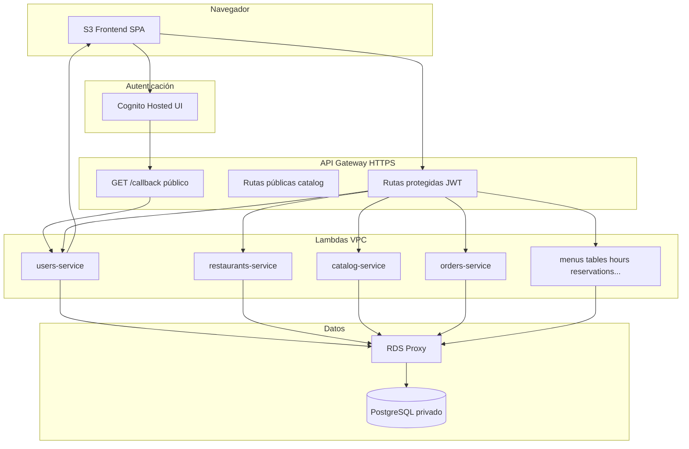
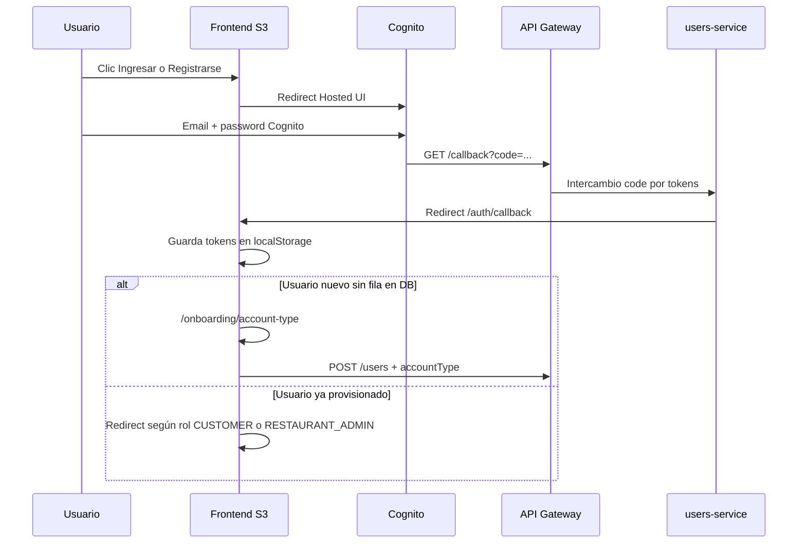
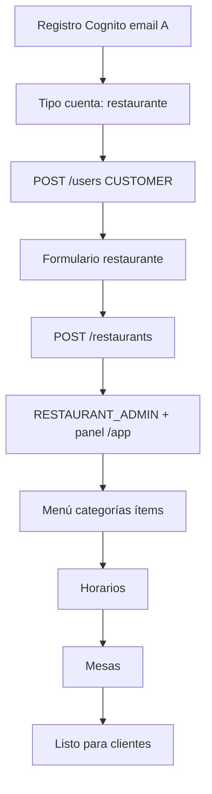

# Abricot TP3 — Guía de ejecución y evaluación (cátedra)

Guía **paso a paso** para que la cátedra pueda desplegar, verificar y probar el TP3 **sin instalar el proyecto en una PC local**. Todo el despliegue productivo corre en **GitHub Actions** contra **AWS Academy**.

**Tiempo estimado total (primera vez):** 25–45 minutos (Terraform + RDS + Lambdas + frontend). Re-ejecutar **Deploy Production** en el mismo lab suele tardar menos.

---

## Índice

1. [Qué entrega el alumno](#1-qué-entrega-el-alumno)
2. [Checklist antes de empezar](#2-checklist-antes-de-empezar)
3. [Configurar GitHub (secrets y variables)](#3-configurar-github-secrets-y-variables)
4. [Ejecutar workflows en GitHub](#4-ejecutar-workflows-en-github)
5. [Obtener URLs del despliegue](#5-obtener-urls-del-despliegue)
6. [Verificación técnica automática (sin navegador)](#6-verificación-técnica-automática-sin-navegador)
7. [Arquitectura y flujo de autenticación](#7-arquitectura-y-flujo-de-autenticación)
8. [Flujo A — Propietario de restaurante (reproducible)](#8-flujo-a--propietario-de-restaurante-reproducible)
9. [Flujo B — Cliente / comensal (reproducible)](#9-flujo-b--cliente--comensal-reproducible)
10. [Criterios de aprobación / fallo](#10-criterios-de-aprobación--fallo)
11. [Problemas frecuentes](#11-problemas-frecuentes)
12. [Destruir el entorno](#12-destruir-el-entorno)
13. [Referencia: secrets, variables y workflows](#13-referencia-secrets-variables-y-workflows)
14. [Anexo: revisión de código local (opcional)](#14-anexo-revisión-de-código-local-opcional)

---

## 1. Qué entrega el alumno

| Pieza | Repositorio / carpeta | Notas |
|-------|----------------------|--------|
| Backend + Terraform + workflows | **Este repo** (`Abricot-be`) | Contiene `.github/workflows/` |
| Frontend Vue 3 | Repo GitHub separado (default: `NaPrado/Abricot-few`) | El workflow lo clona y sube a S3 |
| Documentación de planificación | `PLAN/` (si viene en el PR) | No hace falta para deploy |

**Forma de entrega:** Pull Request a la rama asignada (`main` o `dev`). La cátedra **mergea el PR** y luego ejecuta los workflows desde la pestaña **Actions** del repositorio backend.

---

## 2. Checklist antes de empezar

Marque cada ítem antes de correr **Deploy Production**:

- [ ] Cuenta de **GitHub** con permisos de administración sobre el repositorio del alumno.
- [ ] **AWS Academy Learner Lab** iniciado (botón *Start Lab*). Sin lab activo los workflows fallan.
- [ ] Credenciales AWS copiadas desde **AWS Details → AWS CLI** (las tres líneas: Access Key, Secret Key, Session Token).
- [ ] Los **secrets** de la sección 3 cargados en GitHub (sin commitear valores al repo).
- [ ] PR del alumno **mergeado** en `main` o `dev`.
- [ ] Navegador con ventana de incógnito (recomendado) para probar dos usuarios distintos sin mezclar sesiones.
- [ ] **Dos direcciones de email** distintas para Cognito (ej. `profesor-owner@mail.com` y `profesor-cliente@mail.com`). Cognito exige email único por usuario.

> **No usar** contraseñas o claves que aparezcan en archivos del repositorio del alumno (por ejemplo `infra/terraform.tfvars`). La contraseña de PostgreSQL debe ir **solo** en el secret `TF_VAR_POSTGRES_PASSWORD`.

---

## 3. Configurar GitHub (secrets y variables)

Ruta en GitHub (repositorio **Abricot-be** del alumno):

`Settings` → `Secrets and variables` → `Actions`

### 3.1 Secrets obligatorios (pestaña *Secrets* → *Repository secrets* → *New repository secret*)

Copie **exactamente** estos nombres (respete mayúsculas y guiones):

| Nombre del secret | Qué pegar | Ejemplo de origen |
|-------------------|-----------|-------------------|
| `AWS_ACCESS_KEY_ID` | Primera línea del bloque AWS CLI del lab | `ASIA...` |
| `AWS_SECRET_ACCESS_KEY` | Segunda línea | cadena larga |
| `AWS_SESSION_TOKEN` | Tercera línea | cadena larga |
| `TF_VAR_POSTGRES_PASSWORD` | Una contraseña fuerte **elegida por la cátedra** (mín. 12 caracteres) | No commitear este valor |

### 3.2 Secrets opcionales

| Nombre | Cuándo usarlo |
|--------|----------------|
| `FRONTEND_REPO_TOKEN` | Solo si el workflow no puede clonar el repo frontend con el token por defecto de GitHub |

### 3.3 Variables opcionales (pestaña *Variables* → *Repository variables*)

| Nombre | Valor recomendado para evaluación |
|--------|-----------------------------------|
| `FRONTEND_REPOSITORY` | Dejar vacío (usa default `NaPrado/Abricot-few`) o poner `usuario/Abricot-few` si el frontend está en otro fork |
| `TERRAFORM_STATE_BUCKET` | Dejar **vacío** (state en cache de Actions; habitual en el lab) |
| `TERRAFORM_LOCK_TABLE` | Dejar vacío |
| `CLOUDFRONT_DISTRIBUTION_ID` | Dejar vacío (hosting en S3 website) |

---

## 4. Ejecutar workflows en GitHub

Los archivos están en [`.github/workflows/`](.github/workflows/).

### 4.1 Workflow **Validate** (recomendado antes del deploy)

1. Abrir el repo en GitHub → pestaña **Actions**.
2. En el menú izquierdo elegir **Validate**.
3. Botón **Run workflow** (arriba a la derecha).
4. Branch: `main` o `dev` (la que mergearon).
5. **Run workflow**.

**Resultado esperado:** todos los jobs en verde:

- *Terraform Validate*
- *Backend Python*
- *Frontend Node*
- *Terraform Plan* (muestra plan en el summary; no crea infraestructura)

Si *Terraform Plan* falla por credenciales expiradas, renueve los secrets AWS y reintente.

> Este workflow **no despliega** nada en AWS. Es seguro ejecutarlo solo para revisar código.

### 4.2 Workflow **Deploy Production** (despliegue completo)

**Disparadores:** botón manual **Run workflow**, o automático cuando un push a `main`/`dev` termina **Validate** con éxito.

Pasos:

1. **Actions** → **Deploy Production** → **Run workflow**.
2. Elegir la misma rama mergeada (`main` o `dev`).
3. **Run workflow**.
4. Esperar a que terminen **en este orden** los jobs:
   - **Terraform Apply** (15–25 min la primera vez: VPC, RDS, Cognito, API Gateway, Lambdas…)
   - **Lambda Artifacts** (sube ZIPs y actualiza código Lambda)
   - **Frontend Deploy** (build Vue y sync a S3)

**Resultado esperado:** los tres jobs con ✓ verde.

**Si falla Terraform Apply:**

- Leer el log del step que falló.
- Errores típicos: credenciales vencidas, límite de recursos del lab, password de Postgres inválida en el secret.
- Corregir secrets y volver a **Run workflow** en **Deploy Production** (no hace falta re-correr Validate).

**Si el plan contiene `delete`:** el workflow **bloquea** el apply automáticamente (por diseño). No forzar apply manual; revisar el PR del alumno.

### 4.3 Workflow **Destroy Production** (solo al finalizar evaluación)

Ver [sección 12](#12-destruir-el-entorno).

---

## 5. Obtener URLs del despliegue

Tras **Deploy Production** exitoso:

1. Abrir el run → job **Terraform Apply**.
2. Pestaña **Summary** (resumen al final de la página del job).

Ahí debe aparecer texto similar a:

```text
## Infrastructure
- API Gateway: https://xxxxxxxx.execute-api.us-east-1.amazonaws.com
- Cognito domain: https://abricot-tp3-ACCOUNTID.auth.us-east-1.amazoncognito.com
- Frontend URL: http://abricot-tp3-ACCOUNTID-frontend.s3-website-us-east-1.amazonaws.com
- Health URL: https://xxxxxxxx.execute-api.us-east-1.amazonaws.com/health
```

3. **Anotar** en un papel o notas:
   - **URL_FRONTEND** = Frontend URL (S3 website)
   - **URL_API** = API Gateway (sin barra final)
   - **URL_HEALTH** = Health URL

4. Abrir **URL_FRONTEND** en el navegador. Debe cargar la landing de Abricot (pantalla oscura, logo naranja).

Si la página no carga: esperar 1–2 minutos (propagación S3) y refrescar. Si sigue en blanco, revisar que **Frontend Deploy** terminó en verde.

---

## 6. Verificación técnica automática (sin navegador)

Desde cualquier máquina con `curl` (opcional pero recomendado):

```bash
curl -s -o /dev/null -w "%{http_code}\n" "URL_HEALTH"
```

**Resultado esperado:** `200`

Ejemplo (reemplace la URL):

```bash
curl -s -o /dev/null -w "%{http_code}\n" "https://abc123.execute-api.us-east-1.amazonaws.com/health"
```

Opcional — listar restaurantes públicos (catálogo):

```bash
curl -s "URL_API/restaurants?page=1&perPage=5"
```

**Resultado esperado:** JSON con lista (puede estar vacía `[]` antes de crear el primer restaurante).

---

## 7. Arquitectura y flujo de autenticación

### 7.1 Componentes



### 7.2 Registro / login (Cognito únicamente)

**No existe** formulario de email/contraseña en el frontend productivo. Siempre redirige a **Cognito Hosted UI**.



**Importante:** `POST /users` **no** se llama automáticamente en el callback. El usuario nuevo elige tipo de cuenta en `/onboarding/account-type`.

---

## 8. Flujo A — Propietario de restaurante (reproducible)

Use **email A** (ej. `eval-owner@ejemplo.com`) que **nunca** usó antes en este User Pool de Cognito.

### Fase A0 — Alta en Cognito y tipo de cuenta

| # | Acción exacta | Resultado esperado |
|---|---------------|-------------------|
| A1 | Abrir **URL_FRONTEND** en ventana de incógnito | Landing Abricot |
| A2 | Clic **Registrarse** (o ir a `/register`) | Redirección a Cognito signup |
| A3 | Completar email A + contraseña Cognito (mín. 8 caracteres, mayúsculas, números según política Cognito) + confirmar registro | Vuelta al flujo OAuth |
| A4 | Tras login, llegar a `/auth/callback` brevemente | Mensaje de procesamiento |
| A5 | Si es usuario nuevo → pantalla **¿Cómo vas a usar Abricot?** | Dos tarjetas: comensal / restaurante |
| A6 | Clic **Tengo un restaurante** | Carga “Creando tu cuenta…” |
| A7 | Pantalla **Registrá tu restaurante** (`/onboarding/restaurant`) | Formulario de alta del local |

Si en A5 no aparece la pantalla de tipo de cuenta y va directo a `/explore` o `/app`, el navegador ya tenía un usuario guardado en `localStorage`. Use incógnito o borre datos del sitio.

### Fase A1 — Crear el restaurante (promoción a admin)

Completar el formulario en `/onboarding/restaurant`:

| Campo | Valor de ejemplo para la prueba |
|-------|--------------------------------|
| Nombre * | `Restaurante Evaluación TP3` |
| Dirección * | `Av. Siempre Viva 742` |
| Teléfono * | `1155551234` |
| Email | `contacto@restauranteeval.com` |
| País * | Argentina (o el que figure en lookups) |
| Provincia * | Seleccionar una provincia |
| Ciudad * | Seleccionar una ciudad |
| Clic **Crear restaurante** | Esperar redirección |

**Resultado esperado:**

- Redirección a `/app/restaurants/{id}` (panel del dueño).
- El usuario queda con rol **RESTAURANT_ADMIN** en la base (solo después de crear el restaurante).

**Si falla:** mensaje de error en pantalla → revisar que **Deploy Production** terminó y que `POST /restaurants` existe en API Gateway (job Terraform Apply OK).

### Fase A2 — Configurar menú digital

Ruta: `/app/restaurants/{id}/menus` (menú en la barra lateral del panel).

| # | Acción | Detalle |
|---|--------|---------|
| A2.1 | Crear un menú | Nombre ej. `Carta principal` → guardar |
| A2.2 | Abrir ese menú | Entrar al detalle del menú |
| A2.3 | Crear categoría | Ej. `Entradas` |
| A2.4 | Crear ítem en la categoría | Nombre `Empanadas`, precio `2500`, disponible |
| A2.5 | (Opcional) Activar/publicar menú | Según UI del panel (menú activo para el público) |

**Verificación:** en incógnito, `URL_FRONTEND/restaurants/{id}` → pestaña de menú/pedido debe mostrar el ítem creado (lee `GET /restaurants/{id}/menus` público o menú activo).

### Fase A3 — Configurar horarios de atención

Ruta: `/app/restaurants/{id}/hours`

| # | Acción | Detalle |
|---|--------|---------|
| A3.1 | Para **Lunes** a **Viernes** | Desmarcar “cerrado” |
| A3.2 | Agregar tramo | Ej. apertura `11:00`, cierre `23:00` |
| A3.3 | Guardar cambios | Debe persistir sin error |

Sin horarios abiertos, el cliente no verá turnos en reservas.

### Fase A4 — Configurar mesas

Ruta: `/app/restaurants/{id}/tables`

| # | Acción | Detalle |
|---|--------|---------|
| A4.1 | Crear mesa | Nombre `Mesa 1`, capacidad `4` |
| A4.2 | (Opcional) Crear `Mesa 2` capacidad `2` | Para probar más de una mesa |

Sin mesas, las reservas del cliente pueden fallar.

### Fase A5 — Verificar panel de gestión

| Ruta | Qué validar |
|------|-------------|
| `/app/restaurants/{id}/reservations` | Lista vacía hasta que un cliente reserve |
| `/app/restaurants/{id}/orders` | Lista vacía hasta que un cliente pida |

**Fin del flujo propietario:** local creado, menú, horarios y mesas listos para recibir clientes.



---

## 9. Flujo B — Cliente / comensal (reproducible)

**Precondición:** el [Flujo A](#8-flujo-a--propietario-de-restaurante-reproducible) completado (existe un restaurante con menú, horarios y mesas).

Use **email B** distinto (ej. `eval-cliente@ejemplo.com`) en **otra ventana de incógnito**.

### Fase B0 — Registro como cliente

| # | Acción | Resultado esperado |
|---|--------|-------------------|
| B1 | Incógnito → **URL_FRONTEND** → **Registrarse** | Cognito signup |
| B2 | Email B + password | OAuth → `/auth/callback` |
| B3 | Elegir **Quiero pedir comida** | `POST /users` con `accountType=customer` |
| B4 | Redirección a `/explore` | Listado de restaurantes |

Debe aparecer el restaurante creado en el Flujo A (nombre `Restaurante Evaluación TP3` o similar).

### Fase B1 — Reservar mesa

| # | Acción | Detalle |
|---|--------|---------|
| B5 | Clic en el restaurante → ficha pública `/restaurants/{id}` | |
| B6 | Pestaña **Reservar** (o sección reservas) | |
| B7 | Elegir **fecha** (día laborable dentro de horarios configurados) | |
| B8 | Elegir **hora** disponible | Si no hay slots: volver al Flujo A3 horarios |
| B9 | Comensales: `2` | |
| B10 | Confirmar reserva | Mensaje de éxito |

**Verificación:**

- Ir a `/me/reservations` → debe listarse la reserva.
- En incógnito como **owner (email A)** → `/app/restaurants/{id}/reservations` → debe aparecer la misma reserva.

### Fase B2 — Realizar pedido (orden)

Seguir en la ficha pública del mismo restaurante:

| # | Acción | Detalle |
|---|--------|---------|
| B11 | Pestaña **Pedir** / menú | |
| B12 | Agregar ítems al carrito (ej. Empanadas x2) | |
| B13 | **Confirmar pedido** | |
| B14 | Mensaje de pedido exitoso | |

**Verificación:**

- `/me/orders` → pedido visible con estado inicial.
- Como **owner (email A)** → `/app/restaurants/{id}/orders` → mismo pedido; puede cambiar estado (ej. confirmado / en preparación) si la UI lo permite.

**Intento de acceso indebido (debe fallar):**

- Con sesión de **cliente (email B)** intentar abrir `/app/restaurants` manualmente en la barra de dirección.
- **Resultado esperado:** redirección a `/explore` o `/me/reservations` (sin acceso al panel dueño).

```mermaid
flowchart TD
  pre[Pre: restaurante con menú horarios mesas] --> reg[Registro Cognito email B]
  reg --> cust[Tipo cuenta: comensal]
  cust --> explore[/explore]
  explore --> sheet[Ficha restaurante]
  sheet --> res[Pestaña Reservar]
  res --> ok1[Reserva en /me/reservations]
  sheet --> order[Pestaña Pedir + carrito]
  order --> ok2[Pedido en /me/orders]
```

---

## 10. Criterios de aprobación / fallo

| Criterio | Pasa | Falla |
|----------|------|-------|
| **Validate** workflow en verde | ✓ | ✗ |
| **Deploy Production** los 3 jobs en verde | ✓ | ✗ |
| `GET /health` → HTTP 200 | ✓ | ✗ |
| Frontend carga desde S3 | ✓ | ✗ |
| Registro Cognito + onboarding owner + creación restaurante | ✓ | ✗ |
| Owner configura menú, horarios y mesas | ✓ | ✗ |
| Cliente reserva y pedido visibles en `/me/*` y panel owner | ✓ | ✗ |
| Cliente no accede a `/app/*` | ✓ | ✗ |
| No hay login legacy con password en frontend | ✓ | ✗ |

---

## 11. Problemas frecuentes

| Síntoma | Causa probable | Qué hacer |
|---------|----------------|-----------|
| `ExpiredToken` / `InvalidClientTokenId` | Lab AWS cerrado o credenciales viejas | Reiniciar lab, copiar **nuevas** 3 credenciales AWS a secrets, re-run **Deploy Production** |
| Terraform timeout en RDS/VPC | Lab lento o límite de recursos | Reintentar deploy; esperar 5 min |
| Frontend Deploy falla al clonar repo | Repo privado o nombre incorrecto | Secret `FRONTEND_REPO_TOKEN` o variable `FRONTEND_REPOSITORY` |
| Pantalla blanca en S3 | Deploy frontend no terminó o URL incorrecta | Ver Summary de Terraform Apply; abrir `frontend_website_url` |
| No aparece tipo de cuenta tras login | Usuario ya en localStorage | Incógnito o limpiar site data |
| Reserva sin horarios | Horarios cerrados o mal configurados | Flujo A3 |
| Pedido falla “sin menú” | Menú sin ítems o no activo | Flujo A2 |
| `POST /users` 401 | Token no guardado | Repetir login desde `/login` |
| Destroy no borra todo | Buckets versionados | El workflow vacía buckets antes del destroy; esperar fin del job |

---

## 12. Destruir el entorno

Solo cuando terminaron la evaluación:

1. **Actions** → **Destroy Production**
2. **Run workflow**
3. Campo **confirm_destroy**: escribir exactamente `DESTROY` (mayúsculas)
4. **Run workflow**
5. Esperar job **Terraform Destroy** en verde

Esto elimina recursos gestionados por Terraform (API Gateway, Lambdas, RDS, Cognito, buckets de frontend y artefactos Lambda, etc.).

---

## 13. Referencia: secrets, variables y workflows

### Workflows ([`.github/workflows/`](.github/workflows/))

| Archivo | Nombre en UI | `workflow_dispatch` |
|---------|-------------|---------------------|
| `validate.yml` | **Validate** | Sí |
| `deploy.yml` | **Deploy Production** | Sí |
| `destroy.yml` | **Destroy Production** | Sí (requiere `DESTROY`) |

Región AWS fija en workflows: **`us-east-1`**.

### Secrets (solo nombres — sin valores en el repo)

`AWS_ACCESS_KEY_ID`, `AWS_SECRET_ACCESS_KEY`, `AWS_SESSION_TOKEN`, `TF_VAR_POSTGRES_PASSWORD`, `FRONTEND_REPO_TOKEN` (opcional)

### Variables (solo nombres)

`FRONTEND_REPOSITORY`, `TERRAFORM_STATE_BUCKET`, `TERRAFORM_LOCK_TABLE`, `CLOUDFRONT_DISTRIBUTION_ID`

### Endpoints útiles tras el deploy

| Uso | Ruta API |
|-----|----------|
| Salud | `GET /health` |
| OAuth (Cognito only) | `GET /callback` |
| Provisión usuario | `POST /users` (JWT, body `accountType`) |
| Crear restaurante (owner) | `POST /restaurants` (JWT) |
| Catálogo | `GET /restaurants`, `GET /lookups` |
| Pedidos | `POST /restaurants/{id}/orders` (JWT) |

Listado completo en [`infra/main.tf`](infra/main.tf). Detalle técnico: [`infra/README.md`](infra/README.md).

---

## 14. Anexo: revisión de código local (opcional)

No reemplaza el deploy en AWS. Solo para revisar el PR antes del merge:

```bash
# En la raíz del clone de Abricot-be
bash ./scripts/package_lambdas.sh
cd infra && terraform init -backend=false && terraform validate
python -m compileall lambdas app
python -m pytest

# Repo frontend (ruta aparte)
pnpm install --frozen-lockfile
pnpm run type-check
pnpm run build
```

---

Más detalle de la infra en [`infra/README.md`](infra/README.md).
