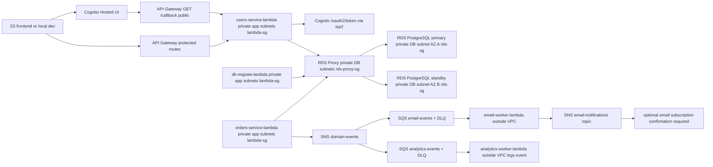

# Abricot TP3 Infrastructure

Terraform root for the Abricot TP3 AWS architecture.

## What This Creates

- Cognito User Pool, App Client, and Hosted UI domain.
- API Gateway HTTP API with:
  - public `GET /health`
  - public `GET /callback`
  - protected `GET /auth-test`
  - protected `POST /users`
  - protected `GET /users/{userId}`
  - protected `PUT /users/{userId}`
  - public `GET /lookups` (when private DB stack is enabled)
  - public `GET /restaurants`
  - public `GET /restaurants/{restaurantId}`
  - public `GET /restaurants/{restaurantId}/menus`
- Python Lambdas:
  - `health-lambda`
  - `users-service-lambda`
  - `catalog-service-lambda` for public catalog reads via RDS Proxy
  - `orders-service-lambda` for protected order APIs and `order.created` publishing
  - `email-worker-lambda` for SQS-driven SNS native email notifications
  - `analytics-worker-lambda` for SQS-driven order analytics event consumption
  - `db-migrate-lambda` for internal Flask-Migrate/Alembic upgrades
- SNS/SQS eventing for orders:
  - `abricot-tp3-domain-events` SNS topic for internal domain fanout
  - `email-events` SQS queue and DLQ
  - `analytics-events` SQS queue and DLQ
  - `email-notifications` SNS topic for native SNS email delivery
  - optional SNS email subscription when `notification_email` is set
- A dedicated VPC with:
  - 2 public subnets for NAT
  - 2 private app subnets for Lambda
  - 2 private DB subnets in different AZs for RDS and RDS Proxy
  - NAT Gateway for private Lambda egress
- Private Multi-AZ PostgreSQL RDS, with primary/standby managed by AWS.
- RDS Proxy in private DB subnets.
- Secrets Manager secret for RDS Proxy credentials.
- Three explicit security groups: `lambda-sg`, `rds-proxy-sg`, `rds-sg`.

Terraform does not create IAM roles and does not use `data.aws_iam_role`.
Both Lambda and RDS Proxy use the AWS Academy `LabRole` ARN derived from the
current account ID through `data.aws_caller_identity.current.account_id`.

## Architecture

1. User opens the frontend from S3 website hosting or local dev.
2. Frontend redirects to Cognito Hosted UI.
3. Cognito redirects to API Gateway `GET /callback`.
4. `GET /callback` is public and invokes `users-service-lambda`.
5. `users-service-lambda` exchanges the authorization code with Cognito and
   redirects to frontend `/auth/callback#access_token=...`.
6. Protected frontend calls use `Authorization: Bearer <access_token>`.
7. API Gateway validates JWTs with the Cognito authorizer.
8. DB-backed users routes invoke `users-service-lambda` in private app subnets.
9. `users-service-lambda` reaches PostgreSQL only through RDS Proxy.
10. Database migrations run on demand through `db-migrate-lambda`, also inside
    private app subnets and also through RDS Proxy.
11. `orders-service-lambda` creates orders synchronously in RDS and, only after
    the DB commit succeeds, publishes an `order.created` event to SNS.
12. SNS fans the event out to independent SQS queues for email and analytics
    workers.
13. `email-worker-lambda` publishes user-facing notifications to the SNS email
    topic. SNS email subscribers must confirm the subscription email before
    delivery starts.

## Diagram



The diagram shows RDS primary/standby because Terraform sets `multi_az = true`.
The application still connects only to RDS Proxy, not directly to either RDS
instance.

## Why RDS Is Private

The RDS instance is created with `publicly_accessible = false` and
`multi_az = true`, placed only in private DB subnets across two AZs, and
attached only to `rds-sg`. There is no public inbound rule and no direct
Lambda-to-RDS rule.

## Why RDS Proxy Exists

RDS Proxy is the only database endpoint exposed to `users-service-lambda`. This
keeps Lambda from connecting directly to RDS and gives a controlled connection
layer between Lambda and PostgreSQL.

`db-migrate-lambda` also connects only to RDS Proxy. It is not exposed through
API Gateway and is invoked manually when schema changes need to be applied.

RDS Proxy requires a Secrets Manager secret and an IAM role it can assume. In
AWS Academy Lab, the only allowed role is LabRole. Terraform derives it as:

```hcl
local.lab_role_arn = "arn:aws:iam::<account-id>:role/LabRole"
```

If LabRole cannot be used by RDS Proxy in the lab account, stop and report the
blocker. Do not use public RDS or direct DB access as a fallback.

## Why Lambda Needs NAT

`users-service-lambda` runs in private app subnets. It still handles
`GET /callback`, so it must call Cognito `/oauth2/token` over the internet.
The private app subnets route outbound internet traffic through NAT Gateway.

## Security Groups

| Component | Security Group | Rules |
|---|---|---|
| `users-service-lambda` | `lambda-sg` | Outbound TCP 5432 to `rds-proxy-sg`; outbound TCP 443 to internet through NAT. |
| RDS Proxy | `rds-proxy-sg` | Inbound TCP 5432 from `lambda-sg`; outbound TCP 5432 to `rds-sg`. |
| RDS PostgreSQL | `rds-sg` | Inbound TCP 5432 only from `rds-proxy-sg`. |

No Lambda direct access to RDS is configured. No public access to RDS is
configured.

## Variables

The normal deliverable path only needs these values in `terraform.tfvars`:

```hcl
project_name = "abricot-tp3"
aws_region   = "us-east-1"

frontend_callback_url = ""
notification_email = ""

postgres_db       = "abricot"
postgres_user     = "abricot_app"
postgres_password = "CHANGE_ME_STRONG_PASSWORD"

enable_full_private_stack = true
```

Internal network and database defaults live in `locals.tf`: CIDRs, AZs, RDS
size, PostgreSQL port, SSL mode, Cognito scopes, and Lambda runtime.

The AWS provider sets `region = var.aws_region`, defaulting to `us-east-1`.
Terraform does not require exporting `AWS_DEFAULT_REGION` or `AWS_REGION`.

## Deploy From Zero

The Lambda packages use `pg8000`, a pure-Python PostgreSQL driver. This avoids
native `_psycopg` binary compatibility issues and lets `package_lambdas.sh` run
with the available `python3` as long as Python and pip are installed.

From `/Repositorio/Abricot-be`:

```bash
python3 --version
./scripts/package_lambdas.sh
cd infra
cp terraform.tfvars.example terraform.tfvars
```

Edit `terraform.tfvars`:

- Required: replace `postgres_password` with a strong password.
- Optional: keep `aws_region = "us-east-1"` unless the lab explicitly uses a
  different region.
- Optional: leave `frontend_callback_url` empty to use the Terraform-managed S3
  website callback URL, or override it with localhost for local smoke tests.
- Optional: set `notification_email` to subscribe one email endpoint to the SNS
  email topic. AWS sends a confirmation email; no email is delivered until the
  recipient confirms it.

If updating an older local `terraform.tfvars`, remove `lambda_role_arn` and
`rds_proxy_role_arn`; Terraform now derives LabRole automatically. Also remove
`users_service_layer_arns`; this delivery packages dependencies into
`build/lambdas/*` instead of using Lambda Layers.

Then run:

```bash
terraform init
terraform fmt
terraform validate
terraform plan
terraform apply
```

`./scripts/package_lambdas.sh` creates the generated folders under
`build/lambdas/*` for API Lambdas, internal worker Lambdas, and
`db_migrate`. Terraform zips those build folders with `archive_file`. The
`build/` folder is generated and gitignored.

## Orders SNS/SQS Flow

Order creation remains synchronous from the frontend perspective:

1. Frontend calls `POST /restaurants/{restaurantId}/orders`.
2. `orders-service-lambda` validates Cognito and writes the order to RDS through
   RDS Proxy.
3. After the DB commit succeeds, it publishes this event to
   `abricot-tp3-domain-events`:

```json
{
  "eventType": "order.created",
  "eventVersion": "1.0",
  "occurredAt": "<ISO timestamp>",
  "source": "orders-service",
  "data": {
    "orderId": "...",
    "restaurantId": "...",
    "userId": "...",
    "status": "...",
    "total": 123.45,
    "currency": "ARS"
  }
}
```

If SNS publishing fails after the order is committed, the order response still
succeeds and the failure is logged with stacktrace. The event is not published
when the DB insert/commit fails.

The domain event topic fans out to two queues:

- `email-events`, consumed by `email-worker-lambda`.
- `analytics-events`, consumed by `analytics-worker-lambda`.

Each queue has its own DLQ. The email worker is outside the VPC and has no DB
environment variables. It publishes notification messages to the SNS
`email-notifications` topic, which can deliver by native SNS `email`
subscription. This does not use SMTP, SES, or an external provider.

The analytics worker currently logs `order.created` as processed. It does not
write to RDS because there is no safe dedicated analytics persistence table for
order events in the current schema, and PASO 5 must not create a migration just
for analytics.

## Database Migrations

RDS is private and Multi-AZ, so the laptop cannot run `flask db upgrade`
against it directly. The cloud equivalent is `abricot-tp3-db-migrate`.

Run migrations after Terraform creates or updates the private database stack,
and before testing DB-backed routes such as `POST /users`.

Invoke the migration Lambda:

```bash
aws lambda invoke \
  --function-name abricot-tp3-db-migrate \
  --payload '{"action":"upgrade"}' \
  --cli-binary-format raw-in-base64-out \
  --region us-east-1 \
  migration-response.json
cat migration-response.json
```

Validate that the schema exists through the same private path:

```bash
aws lambda invoke \
  --function-name abricot-tp3-db-migrate \
  --payload '{"action":"validate"}' \
  --cli-binary-format raw-in-base64-out \
  --region us-east-1 \
  schema-validation-response.json
cat schema-validation-response.json
```

The validation response includes the current Alembic revision and the list of
tables visible in the `public` schema. This is the expected validation path
because there is no public or direct DB access from the laptop.

## Optional AWS CLI Verification

Terraform itself uses `var.aws_region`, so no region environment variable is
required. For raw AWS CLI checks, either configure a default once:

```bash
aws configure set region us-east-1
```

or keep commands copy-paste safe with `--region us-east-1`:

```bash
aws sts get-caller-identity --region us-east-1
aws rds describe-db-instances --db-instance-identifier abricot-tp3-postgres --region us-east-1
aws rds describe-db-proxies --db-proxy-name abricot-tp3-users-proxy --region us-east-1
aws apigatewayv2 get-apis --region us-east-1
```

## Destroy And Recreate

The stack is designed to be destroyable and recreateable:

```bash
terraform destroy
terraform apply
```

If the Cognito User Pool contains users, AWS may block deletion unless the pool
is cleaned first. Do not manually delete random resources outside Terraform
unless state recovery is planned.

## Optional Two-Phase Recovery

The normal path is one full stack apply with:

```hcl
enable_full_private_stack = true
```

If AWS provider behavior rejects changing `users-service-lambda` from no
`vpc_config` to `vpc_config` in the same apply, use this emergency sequence:

Phase 1:

```hcl
enable_full_private_stack = true
recovery_skip_lambda_private_attachment = true
```

Apply only if the plan creates or repairs VPC, NAT, private RDS, RDS Proxy, and
RDS Proxy target without destroying PASO 1.

Phase 2:

```hcl
enable_full_private_stack = true
recovery_skip_lambda_private_attachment = false
```

Then plan/apply the Lambda private subnet attachment and `/users` routes.

This is only a recovery path. Do not present public RDS, direct DB access, or
removing RDS Proxy as alternatives.
